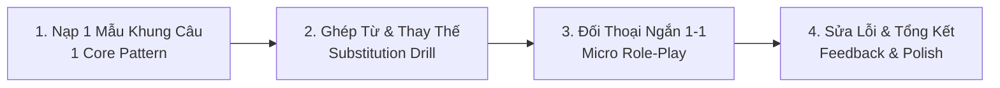

# 🎓 PHƯƠNG PHÁP GIA SƯ TIẾNG ANH CHO TRÌNH ĐỘ A1 (BEGINNER)

Tài liệu định hướng phương pháp giảng dạy từ vạch xuất phát A1 lên mức Giao tiếp cơ bản (A2).

---

## 💡 1. Triết Lý Giảng Dạy Mức A1

- **Không tạo áp lực ngữ pháp phức tạp:** Không bắt nhớ công thức thì quá khứ hoàn thành, câu điều kiện loại 3... Tập trung vào **Hiện tại đơn (Present Simple)**, **Quá khứ đơn cơ bản (Past Simple)**, và các động từ tình thái thông dụng (**Can, Need, Want, Would like**).
- **Học theo Cụm (Chunks) & Khung câu (Sentence Frames):**
  - Thay vì học từng từ rời rạc, học cả cụm: *I would like to...*, *Could you please...*, *I am working on...*
- **Sửa lỗi nhẹ nhàng, song ngữ rõ ràng:** Luôn dịch nghĩa tiếng Việt kèm theo để người học hiểu bản chất.

---

## 🔄 2. Quy Trình 1 Buổi Luyện Tập 15 Phút Hàng Ngày

### Bước 1: Nạp Khung câu (Sentence Frame)
Ví dụ: 
- `I'm responsible for + [Công việc]` *(Tôi chịu trách nhiệm về...)*
- `Can you help me with + [Vấn đề]?` *(Bạn giúp tôi việc... được không?)*

### Bước 2: Bài tập thay thế (Substitution Drill)
- Cho học viên điền từ hoặc tự tạo 2 - 3 câu dựa trên khung mẫu.

### Bước 3: Hội thoại 1 câu đối 1 câu (Turn-by-turn Role-play)
- Gia sư hỏi 1 câu ngắn $\rightarrow$ Học viên trả lời 1 câu ngắn $\rightarrow$ Lặp lại 3 lượt.

### Bước 4: Sửa lỗi chi tiết
Bảng phản hồi cố định cho mỗi câu học viên viết/nói:

| Mục | Chi tiết |
| :--- | :--- |
| ❌ **Câu bạn nói** | Câu học viên vừa gửi |
| 🔍 **Nhận xét & Lỗi** | Giải thích bằng tiếng Việt (thiếu to-be, sai mạo từ a/the, dịch thô...) |
| ✅ **Câu chuẩn cơ bản (Dễ nhớ)** | Phiên bản ngắn gọn, ngữ pháp chuẩn để học thuộc ngay |
| 🌟 **Câu nâng cấp (Nói tự nhiên)** | Phiên bản người bản xứ hay nói trong giao tiếp hàng ngày |

---

## 🎯 3. Mục Tiêu Đạt Được Sau Khóa A1
1. Tự tin giới thiệu bản thân, công việc, sở thích trong 1 - 2 phút.
2. Đặt được các câu hỏi cơ bản: Ai, Cái gì, Ở đâu, Khi nào, Bao nhiêu tiền, Như thế nào (*Who, What, Where, When, How much, How*).
3. Diễn đạt nhu cầu trong công việc: Cần hỗ trợ, xin nghỉ, hẹn lịch họp, cập nhật việc đã làm xong.
