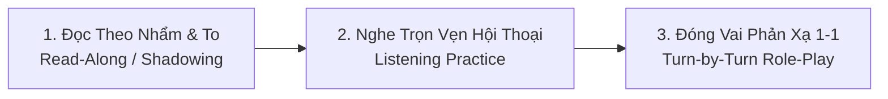

# 🎓 GIA SƯ TIẾNG ANH GIAO TIẾP & KỸ THUẬT AUDIO VISUAL (A1 -> A2/PRO)
### 👨‍💻 Tác giả: **By Chí Cường** | Chuyên gia Tư vấn & Kiến trúc Trải nghiệm Audio Visual
*Sổ tay phương pháp đào tạo và ngân hàng kịch bản đối thoại thực chiến hợp nhất (Unified English Coach & Conversation Handbook).*

---

# PHẦN 1: PHƯƠNG PHÁP GIA SƯ & QUY TRÌNH LUYỆN TẬP

## 💡 1. Triết Lý Giảng Dạy Dành Riêng Cho Kỹ Sư AV (Trình độ A1 -> A2)
1. **Không tạo áp lực ngữ pháp hàn lâm:** Tập trung làm chủ hệ thống các thì cốt lõi gắn liền với hoạt động công trường: **Hiện tại đơn (SOP tiêu chuẩn)**, **Hiện tại tiếp diễn (Thi công trực tiếp)**, **Quá khứ đơn (Báo cáo mốc hoàn thành)**, **Tương lai đơn (Cam kết tiến độ)** và **Bị động kỹ thuật (Thông số kết nối phần cứng)**.
2. **Học theo Cụm từ (Chunks) & Khung câu (Sentence Frames):**
   - Thay vì học từng từ đơn lẻ, học trọn vẹn cả cấu trúc: *I am responsible for...*, *Since there is no underfloor conduit, we must install...*, *This modification will incur additional costs...*
3. **Song ngữ đối chiếu Anh - Việt:** 100% kịch bản đều có bản dịch song ngữ kỹ thuật chuẩn xác, bảo đảm hiểu sâu bản chất kỹ thuật và sẵn sàng ứng dụng trong giao tiếp với Chủ đầu tư, Tư vấn và các nhà thầu liên quan.

---

## 🎧 2. Quy Trình 3 Bước Luyện Đọc Theo (Read-Along) & Luyện Nghe (Listening)

Mỗi kịch bản đối thoại được thiết kế chuyên sâu với 10 đến 14 lượt thoại (communicative turns) phản ánh chính xác các tình huống thực tế tại công trường:



* **Bước 1 - Đọc theo (Read-Along / Shadowing):** Nhìn từng câu thoại tiếng Anh trong kịch bản và đọc to theo khẩu hình, bấm nghe giọng đọc mẫu để luyện ngữ điệu.
* **Bước 2 - Luyện nghe qua Studio Tương Tác:** Mở tệp offline [ENGLISH_AV_TRAINER.html](file:///d:/WORKFLOW/CHI%20CUONG%20ANTIGRAVITY/CHI%20CUONG%20WORKSPACE/LEARN/ENGLISH_AV_TRAINER.html) trên trình duyệt, bấm phát audio từng câu, bật tính năng lặp câu (Loop Line) và nhấp vào bất kỳ từ nào để tra từ điển tức thì (Click-to-Translate).
* **Bước 3 - Đối thoại trực tiếp trong Chat:** Gõ tên hoặc số thứ tự chủ đề vào ô chat, Gia sư AI sẽ đóng vai đối phương hỏi từng câu một để bạn tự gõ câu đáp và sửa lỗi ngay lập tức.

---

## 📋 3. Bảng Phản Hồi Sửa Lỗi Cố Định Khi Đối Thoại Trong Chat

| Mục | Nội dung chi tiết |
| :--- | :--- |
| ❌ **Câu bạn nói (Original)** | Câu học viên vừa gõ hoặc nói |
| 🔍 **Nhận xét & Lỗi** | Giải thích bằng tiếng Việt (thiếu động từ to-be, sai thì, thiếu mạo từ, dùng từ chưa tự nhiên...) |
| ✅ **Câu chuẩn cơ bản (Easy to remember)** | Phiên bản ngắn gọn, ngữ pháp chuẩn xác để nhớ ngay tại chỗ |
| 🌟 **Câu tự nhiên chuyên nghiệp (Native/Pro)** | Phiên bản kỹ sư bản xứ thường nói trong họp dự án hoặc giao tiếp công trường |

---

# PHẦN 2: MA TRẬN 12 THÌ & NGỮ PHÁP KỸ THUẬT AV

## 🌟 Hệ Thống 12 Thì Theo Dòng Thời Gian (Timeline & Aspect Matrix)

| Thể \ Thời gian | ⏳ QUÁ KHỨ (PAST) | ⏱️ HIỆN TẠI (PRESENT) | 🚀 TƯƠNG LAI (FUTURE) |
| :--- | :--- | :--- | :--- |
| **Đơn (Simple)** | **Past Simple ⭐**<br/>`S + V2/ed`<br/>*"I finished the audio design yesterday."*<br/>*(Tôi đã hoàn thành thiết kế hôm qua)* | **Present Simple ⭐**<br/>`S + V(s/es)`<br/>*"The DSP controls all speaker zones."*<br/>*(DSP điều khiển các vùng loa theo SOP)* | **Future Simple ⭐**<br/>`S + will + V-inf`<br/>*"We will email the quote tomorrow."*<br/>*(Chúng tôi sẽ gửi báo giá vào sáng mai)* |
| **Tiếp diễn (Continuous)** | **Past Continuous**<br/>`S + was/were + V-ing`<br/>*"I was testing the mic at 3 PM."*<br/>*(Tôi đang đo thử micro lúc 3h chiều)* | **Present Continuous ⭐**<br/>`S + am/is/are + V-ing`<br/>*"We are commissioning the LED now."*<br/>*(Chúng tôi đang đo kiểm màn LED lúc này)* | **Future Continuous**<br/>`S + will be + V-ing`<br/>*"I will be attending the expo next week."*<br/>*(Tôi sẽ đang tham dự triển lãm tuần tới)* |
| **Hoàn thành (Perfect)** | **Past Perfect**<br/>`S + had + V3/ed`<br/>*"Cables had been pulled before ceiling closed."*<br/>*(Cáp đã được kéo trước khi đóng trần)* | **Present Perfect ⭐**<br/>`S + have/has + V3/ed`<br/>*"We have installed all floor trunking."*<br/>*(Chúng tôi đã hoàn thành lắp toàn bộ nẹp)* | **Future Perfect**<br/>`S + will have + V3/ed`<br/>*"We will have completed handover by Friday."*<br/>*(Chúng tôi sẽ hoàn tất bàn giao trước thứ Sáu)* |
| **Hoàn thành Tiếp diễn** | **Past Perf. Cont.**<br/>`S + had been + V-ing`<br/>*"We had been testing for 2 hours."*<br/>*(Đã đo thử liên tục 2 tiếng trước đó)* | **Present Perf. Cont.**<br/>`S + have/has been + V-ing`<br/>*"We have been pulling cables all morning."*<br/>*(Đã kéo cáp liên tục từ sáng đến giờ)* | **Future Perf. Cont.**<br/>`S + will have been + V-ing`<br/>*"I will have been working here for 2 years."*<br/>*(Tôi sẽ làm việc ở đây tròn 2 năm)* |

---

# PHẦN 2.2: KIẾN TRÚC TỪ LOẠI & VỊ TRÍ CÚ PHÁP TRONG CÂU (PARTS OF SPEECH & SYNTAX ARCHITECTURE)

## 💡 1. Mô Hình Liên Tưởng "Hệ Thống AV" Cho 5 Từ Loại Cốt Lõi

Thay vì học ngữ pháp một cách khô khan, hãy liên tưởng một câu tiếng Anh hoàn chỉnh giống như một **Hệ Thống Tích Hợp Audio-Visual**:

```
+---------------------------------------------------------------------------------------------------+
|                                     HỆ THỐNG CÂU TIẾNG ANH                                       |
+---------------------------------------------------------------------------------------------------+
|  🔵 DANH TỪ (Noun - N)      | 🖥️ THIẾT BỊ PHẦN CỨNG (Loa, DSP, Switch, Kỹ sư, Khách hàng, Ngân sách) |
|  🟢 ĐỘNG TỪ (Verb - V)      | ⚡ NGUỒN ĐIỆN & TÍN HIỆU (Kéo cáp, đo đạc, cấu hình, vận hành, kiểm tra) |
|  🟡 TÍNH TỪ (Adjective - Adj)| 📊 BẢNG THÔNG SỐ & ĐÈN BÁO (Sạch, cách ly, chịu lực, méo tiếng, 4K, bận)   |
|  🟣 TRẠNG TỪ (Adverb - Adv) | 🎛️ FADER ÂM LƯỢNG & NÚM EQ (Nhanh, cẩn thận, tự động, hoàn toàn, cực kỳ) |
|  ⚪ GIỚI TỪ (Preposition - Prep)| 🔌 ĐẦU GIẮC CẮM & TUYẾN ĐI DÂY (Bên trong, dưới sàn, trên trần, tới tủ rack) |
+---------------------------------------------------------------------------------------------------+
```

---

## 📐 2. Bảng Ma Trận 5 Từ Loại: Bản Chất, Vị Trí Trong Câu & Ví Dụ Thực Chiến

| Từ Loại & Ký Hiệu | Bản Chất & Liên Tưởng AV | Vị Trí Chuẩn Trong Cấu Trúc Câu | Ví Dụ Giao Tiếp Hằng Ngày | Ví Dụ Kỹ Thuật AV Công Trường |
| :--- | :--- | :--- | :--- | :--- |
| **🔵 DANH TỪ<br/>(Noun - N)** | **Phần cứng & Nhân sự**<br/>• Là người, vật, thiết bị, địa điểm hoặc khái niệm trừu tượng.<br/>• Trả lời câu hỏi: *Ai? Cái gì?* | 1. Đứng đầu câu làm **Chủ ngữ (S)**:<br/>`[Noun] + Verb`<br/>2. Đứng sau động từ làm **Tân ngữ (O)**:<br/>`Verb + [Noun]`<br/>3. Đứng sau giới từ:<br/>`Preposition + [Noun]` | *"**The manager** ordered **lunch** for **the team**."*<br/>*(Quản lý đã đặt bữa trưa cho cả đội)* | *"**The technician** measured **the SPL** at **the rack**."*<br/>*(Kỹ thuật viên đo mức áp suất âm tại tủ rack)* |
| **🟢 ĐỘNG TỪ<br/>(Verb - V)** | **Nguồn điện & Luồng tín hiệu**<br/>• Tạo ra hành động hoặc biểu thị trạng thái tồn tại.<br/>• Thiếu động từ, câu chết như hệ thống AV mất nguồn! | 1. Đứng ngay sau Chủ ngữ:<br/>`[Subject] + [Main Verb]`<br/>2. Đứng sau Modal Verbs:<br/>`can / must / will + [V-inf]`<br/>3. Nối Chủ ngữ với Tính từ:<br/>`S + [is / are / look] + Adj` | *"I **will call** you when I **arrive** at the café."*<br/>*(Tôi sẽ gọi bạn khi tôi đến quán cà phê)* | *"We **must terminate** the cable and **verify** the Dante clock."*<br/>*(Chúng ta phải bấm đầu cáp và kiểm tra xung đồng hồ Dante)* |
| **🟡 TÍNH TỪ<br/>(Adjective - Adj)** | **Bảng thông số & Đèn trạng thái**<br/>• Miêu tả đặc tính, kích thước, phẩm chất hoặc tình trạng của Danh từ.<br/>• Trả lời câu hỏi: *Như thế nào? Loại nào?* | 1. Đứng **TRƯỚC** Danh từ để bổ nghĩa:<br/>`[Adj] + [Noun]`<br/>2. Đứng **SAU** Linking Verbs (to-be, sound, look):<br/>`S + [be / sound] + [Adj]` | *"Today is a **busy** day, but the coffee is **delicious**."*<br/>*(Hôm nay là ngày bận rộn nhưng cà phê rất ngon)* | *"We need **clean** power and an **isolated** ground."*<br/>*(Chúng tôi cần nguồn điện sạch và tiếp địa cách ly)* |
| **🟣 TRẠNG TỪ<br/>(Adverb - Adv)** | **Fader âm lượng & Núm xoay EQ**<br/>• Tinh chỉnh mức độ, tần suất, cách thức hoặc thời gian.<br/>• Trả lời: *Làm thế nào? Mức độ nào? Khi nào?* | 1. Bổ nghĩa Động từ (đứng sau V hoặc cuối câu):<br/>`[Verb] + [Adv]`<br/>2. Bổ nghĩa Tính từ (đứng trước Adj):<br/>`[Adv] + [Adj]`<br/>3. Bổ nghĩa cả câu (đứng đầu câu):<br/>`[Adv], [Sentence]` | *"Could you speak **slowly**? I am **extremely** tired today."*<br/>*(Bạn nói chậm được không? Tôi đang cực kỳ mệt mỏi hôm nay)* | *"The system **automatically** switches shots **smoothly**."*<br/>*(Hệ thống tự động chuyển góc quay một cách mượt mà)* |
| **⚪ GIỚI TỪ<br/>(Preposition - Prep)** | **Đầu giắc cắm & Tuyến đi cáp**<br/>• Kết nối danh từ với phần còn lại của câu theo không gian hoặc thời gian.<br/>• Trả lời: *Ở đâu? Khi nào? Hướng nào?* | • Luôn đứng **TRƯỚC** Danh từ hoặc Cụm danh từ:<br/>`[Prep] + [Noun Phrase]`<br/>*(inside, under, across, between, before, after)* | *"Let's meet **at** the lobby **before** noon."*<br/>*(Hãy gặp nhau ở sảnh trước buổi trưa)* | *"Route all cables **under** the floor **to** the main rack."*<br/>*(Kéo toàn bộ dây dưới mặt sàn về tủ rack trung tâm)* |

---

## 🏗️ 3. 5 Khung Cấu Trúc Vị Trí Cốt Lõi Trong Giao Tiếp (Syntax Slot Blueprints)

Mỗi khi muốn đặt một câu tiếng Anh trong công việc hoặc đời sống, hãy lắp các từ loại vào đúng 5 "khay" (slots) dưới đây:

### Khung 1: Câu Hành Động Tiêu Chuẩn (Action Blueprint)
```
[ CHỦ NGỮ (S) ]   +   [ ĐỘNG TỪ (V) ]   +   [ TÂN NGỮ (O) ]   +   [ GIỚI TỪ + NƠI CHỐN/THỜI GIAN ]
(Noun Phrase)         (Action Verb)         (Noun Phrase)         (Prepositional Phrase)
```
* *Giao tiếp đời sống:* `[Our manager] + [booked] + [a table] + [at the restaurant].`
* *Kỹ thuật AV:* `[The installer] + [mounted] + [the ceiling speakers] + [inside Meeting Room 3].`

### Khung 2: Câu Miêu Tả Tình Trạng & Thông Số (Status Blueprint)
```
[ CHỦ NGỮ (S) ]   +   [ TO-BE / LINKING VERB ]   +   [ TRẠNG TỪ ĐỘ ]   +   [ TÍNH TỪ (ADJ) ]
(Noun Phrase)         (is / are / was / sound)       (Adverb)            (Condition / Status)
```
* *Giao tiếp đời sống:* `[The meeting schedule] + [is] + [extremely] + [tight].`
* *Kỹ thuật AV:* `[The Dante touch panel] + [is] + [currently] + [offline].`

### Khung 3: Cụm Danh Từ Bổ Nghĩa Đa Tầng (Multi-Layer Noun Phrase)
```
[ MẠO TỪ / SỞ HỮU ]   +   [ TRẠNG TỪ ]   +   [ TÍNH TỪ ]   +   [ DANH TỪ PHỤ ]   +   [ DANH TỪ CHÍNH ]
(a / the / our)           (Adverb)           (Adjective)       (Noun Adjunct)       (Core Noun)
```
* *Ví dụ:* `our` + `extremely` + `reliable` + `network` + `switch` *(Bộ chuyển mạch mạng cực kỳ tin cậy của chúng tôi)*.
* *Ví dụ:* `a` + `heavy-duty` + `floor` + `trunking` *(Nẹp sàn kỹ thuật chịu lực cao)*.

### Khung 4: Câu Yêu Cầu Kỹ Thuật Với Modal Verb (Requirement Blueprint)
```
[ CHỦ NGỮ (S) ]   +   [ MODAL VERB ]   +   [ ĐỘNG TỪ NGUYÊN THỂ ]   +   [ CỤM TÂN NGỮ (O) ]
(We / MEP / Client)   (must / should / can)  (V-inf)                      (Noun Phrase)
```
* *Ví dụ:* `[We] + [must isolate] + [the audio ground] + [to eliminate noise].`
* *Ví dụ:* `[Could you] + [reschedule] + [the sign-off meeting] + [to 2 PM]?`

---

## 🔄 4. Bảng Chuyển Đổi Họ Từ Vựng Kỹ Thuật AV (AV Word Families)

Học 1 gốc từ, làm chủ cả 4 từ loại giúp bạn nói câu tự nhiên và viết email / hồ sơ thầu chuyên nghiệp:

| Gốc Từ | 🟢 Động Từ (Verb) | 🔵 Danh Từ (Noun) | 🟡 Tính Từ (Adjective) | 🟣 Trạng Từ (Adverb) | Câu Ứng Dụng Thực Chiến AV |
| :--- | :--- | :--- | :--- | :--- | :--- |
| **connect** | connect *(kết nối)* | connection *(mối nối)* | connected *(đã nối)* | connectively | *"Ensure all wireless receivers are properly **connected** to the switch."* |
| **isolate** | isolate *(cách ly)* | isolation *(sự cách ly)* | isolated *(biệt lập/cách ly)*| isolatedly | *"We specified an **isolated** technical ground for the main rack."* |
| **operate** | operate *(vận hành)* | operation *(sự vận hành)* | operational *(sẵn sàng chạy)*| operationally | *"The conference room AV system is now fully **operational**."* |
| **configure** | configure *(cấu hình)*| configuration *(cấu hình)* | configurable *(tùy biến)* | configurably | *"Please backup the DSP **configuration** file before updating firmware."* |
| **vary** | vary *(thay đổi)* | variation *(phát sinh VO)* | variable *(biến thiên)* | variably | *"Any site clash will result in a cost **variation**."* |
| **amplify** | amplify *(khuếch đại)*| amplifier *(cục đẩy công suất)*| amplified *(được khuếch đại)*| amplifyingly | *"The multi-zone power **amplifier** drives all 70V ceiling speakers."* |

---

## 🎯 5. Bộ 4 Quy Tắc Vàng Tránh Lỗi Vị Trí Từ Loại Trong Giao Tiếp

1. **Quy tắc Tính từ đứng trước Danh từ:**
   - ❌ *Sai:* "We need power clean and trunking floor."
   - ✅ *Đúng:* "We need **clean power** and **floor trunking**." *(Tính từ và danh từ phụ luôn đứng TRƯỚC danh từ chính)*.
2. **Quy tắc Động từ to-be đi với Tính từ, Động từ thường đi với Trạng từ:**
   - ❌ *Sai:* "The system works good" hoặc "The signal is clearly."
   - ✅ *Đúng:* "The system works **well** / **smoothly**." *(Trạng từ bổ nghĩa cho động từ thường works)*.
   - ✅ *Đúng:* "The signal is **clear**." *(Tính từ bổ nghĩa cho chủ ngữ sau to-be is)*.
3. **Quy tắc Trạng từ chỉ mức độ đứng TRƯỚC Tính từ:**
   - ❌ *Sai:* "The room is dust-free completely."
   - ✅ *Đúng:* "The room is **completely dust-free**." *(completely đứng trước tính từ dust-free)*.
4. **Quy tắc Giới từ luôn đòi hỏi một Danh từ phía sau:**
   - ❌ *Sai:* "We pull cables inside." *(thiếu tân ngữ không gian)*
   - ✅ *Đúng:* "We pull cables **inside the conduit**." *(inside + danh từ the conduit)*.

---

# PHẦN 3: NGÂN HÀNG 11 CHỦ ĐỀ GIAO TIẾP (10 - 15 LƯỢT THOẠI)


---

## 📌 Chủ đề 01: Giới thiệu bản thân & Vai trò Kỹ sư AV
* **Ngữ cảnh thực tế (Scenario):** Buổi họp khởi động dự án (Kick-off meeting) tại văn phòng Ban Quản lý Dự án tòa nhà văn phòng hạng A. Giám đốc dự án (Project Director) mời bạn giới thiệu bản thân và phạm vi công việc của nhà thầu AV trước các bên tư vấn và thầu phụ.
* **Khung câu nòng cốt (Sentence Frame):** `I am responsible for [Hạng mục/Công việc] in [Dự án/Khu vực].`
* **Từ vựng then chốt:** Senior AV Systems Lead (Trưởng nhóm kỹ thuật AV), Electro-acoustic design (Thiết kế điện âm học), Ballroom sound reinforcement (Tăng cường âm thanh hội trường), BACnet & RS-232 integration (Tích hợp điều khiển qua BACnet/RS-232), Staging (Tập kết thiết bị).

### 📖 Kịch bản đối thoại thực chiến hoàn chỉnh (12 lượt thoại):
> 👤 **Project Director (Client):**  
> *"Good morning. Could you please introduce yourself and your role on this project?"*  
> *(Chào buổi sáng. Bạn có thể giới thiệu bản thân và vai trò của bạn trong dự án này không?)*  
>
> 🎯 **You (AV Lead):**  
> *"Good morning. My name is Cuong Nguyen, and I am the Senior AV Systems Lead for this project."*  
> *(Chào buổi sáng. Tôi tên là Nguyễn Cường, là Trưởng nhóm kỹ thuật hệ thống AV cho dự án này.)*  
>
> 👤 **Project Director (Client):**  
> *"Nice to meet you, Cuong. How many years have you been working with hospitality and commercial AV systems?"*  
> *(Rất vui được gặp Cường. Bạn đã có bao nhiêu năm kinh nghiệm làm việc với hệ thống AV khách sạn và thương mại?)*  
>
> 🎯 **You (AV Lead):**  
> *"I have over eight years of experience in electro-acoustic design, network audio routing, and central control automation."*  
> *(Tôi có hơn 8 năm kinh nghiệm trong thiết kế điện âm học, định tuyến âm thanh mạng IP và tự động hóa điều khiển trung tâm.)*  
>
> 👤 **Project Director (Client):**  
> *"That's impressive. What specific packages are under your direct responsibility on this site?"*  
> *(Rất ấn tượng. Những gói thầu cụ thể nào thuộc trách nhiệm trực tiếp của bạn tại công trường này?)*  
>
> 🎯 **You (AV Lead):**  
> *"I oversee the ballroom sound reinforcement, all meeting room video conferencing, and the background music system across public areas."*  
> *(Tôi giám sát hệ thống tăng cường âm thanh hội trường, hội nghị truyền hình các phòng họp và âm thanh nền các khu vực công cộng.)*  
>
> 👤 **Project Director (Client):**  
> *"Will your team also handle the integration with our third-party lighting and building management systems?"*  
> *(Đội ngũ của bạn có đảm nhận việc tích hợp với hệ thống chiếu sáng và quản lý tòa nhà (BMS) của bên thứ ba không?)*  
>
> 🎯 **You (AV Lead):**  
> *"Yes, we coordinate closely with the MEP and lighting teams using IP-based control protocols, BACnet, and RS-232 interfaces."*  
> *(Dạ có, chúng tôi phối hợp chặt chẽ với đội cơ điện và chiếu sáng thông qua các giao thức điều khiển IP, BACnet và cổng RS-232.)*  
>
> 👤 **Project Director (Client):**  
> *"Who will be our primary point of contact for daily site inspections and progress reporting?"*  
> *(Ai sẽ là đầu mối liên hệ chính của chúng tôi cho các buổi kiểm tra công trường và báo cáo tiến độ hàng ngày?)*  
>
> 🎯 **You (AV Lead):**  
> *"I am your main technical contact. I attend the morning coordination meetings and supervise all on-site testing."*  
> *(Tôi là đầu mối kỹ thuật chính. Tôi tham gia các cuộc họp phối hợp đầu ngày và trực tiếp giám sát toàn bộ công tác đo kiểm tại hiện trường.)*  
>
> 👤 **Project Director (Client):**  
> *"Excellent. When do you expect to begin the initial cabling verification and equipment staging?"*  
> *(Rất tốt. Khi nào bạn dự kiến bắt đầu công tác kiểm tra kéo cáp và tập kết thiết bị?)*  
>
> 🎯 **You (AV Lead):**  
> *"Our staging begins this Thursday once the central AV rack room is air-conditioned and dust-free."*  
> *(Chúng tôi sẽ bắt đầu tập kết vào thứ Năm tuần này, ngay khi phòng tủ rack trung tâm được cấp điều hòa và vệ sinh sạch bụi.)*  
>
---

## 📌 Chủ đề 02: Rủ đồng nghiệp đi ăn trưa & Cà phê (Small Talk)
* **Ngữ cảnh thực tế (Scenario):** 12h trưa tại văn phòng công trường. Bạn vừa hoàn thành file cấu hình bộ ma trận DSP. Đồng nghiệp David rủ bạn đi ăn trưa tại quán ăn Việt Nam mới mở và uống cà phê trước khi tiếp tục công việc buổi chiều.
* **Khung câu nòng cốt (Sentence Frame):** `Would you like to grab [Món ăn/Đồ uống] with me at [Thời gian/Địa điểm]?`
* **Từ vựng then chốt:** Configuration backup (Sao lưu file cấu hình), Audio sweep (Đo quét âm thanh), Low frequencies (Dải tần thấp), Acoustic response (Đáp tuyến âm học), Iced milk coffee (Cà phê sữa đá), Rack termination (Đấu nối tủ rack).

### 📖 Kịch bản đối thoại thực chiến hoàn chỉnh (10 lượt thoại):
> 👤 **Colleague (David):**  
> *"Hi Cuong, it's already twelve o'clock. Have you finished testing that DSP matrix?"*  
> *(Chào Cường, 12 giờ trưa rồi đấy. Bạn đã đo thử xong bộ ma trận DSP đó chưa?)*  
>
> 🎯 **You (AV Lead):**  
> *"Hey David, I just saved the configuration backup. I am definitely ready for a lunch break."*  
> *(Chào David, tôi vừa lưu file sao lưu cấu hình xong. Tôi hoàn toàn sẵn sàng nghỉ trưa rồi.)*  
>
> 👤 **Colleague (David):**  
> *"Great! Do you want to grab lunch together? A new Vietnamese restaurant just opened across the street."*  
> *(Tuyệt quá! Bạn có muốn đi ăn trưa cùng không? Có quán ăn Việt Nam mới mở ngay bên kia đường.)*  
>
> 🎯 **You (AV Lead):**  
> *"That sounds fantastic. I could really go for a warm bowl of Pho today."*  
> *(Nghe hấp dẫn đấy. Hôm nay tôi thực sự rất thèm một tô Phở nóng hổi.)*  
>
> 👤 **Colleague (David):**  
> *"Perfect. How did the morning audio sweep go in the grand ballroom?"*  
> *(Chuẩn luôn. Buổi đo quét âm thanh sáng nay trong hội trường lớn diễn ra thế nào rồi?)*  
>
> 🎯 **You (AV Lead):**  
> *"The acoustic response is surprisingly smooth, though we need to trim the low frequencies around 125 Hz."*  
> *(Đáp tuyến âm học mượt mà một cách đáng ngạc nhiên, dù chúng ta cần gọt nhẹ dải tần thấp quanh 125 Hz.)*  
>
> 👤 **Colleague (David):**  
> *"Good to hear. Do you want to get some iced coffee after lunch before we head back to the site?"*  
> *(Mừng là mọi thứ ổn. Bạn có muốn uống cà phê đá sau bữa trưa trước khi chúng ta quay lại công trường không?)*  
>
> 🎯 **You (AV Lead):**  
> *"Definitely! A strong iced milk coffee will keep us energized for the rack termination this afternoon."*  
> *(Chắc chắn rồi! Một ly cà phê sữa đá đậm đà sẽ giúp chúng ta tràn đầy năng lượng để đấu nối tủ rack chiều nay.)*  
>
> 👤 **Colleague (David):**  
> *"Let's go then. Should we invite the IT network engineer to join us?"*  
> *(Vậy đi thôi nào. Chúng ta có nên rủ thêm kỹ sư mạng IT đi cùng không?)*  
>
> 🎯 **You (AV Lead):**  
> *"Sure, let's call Mark. We can chat about the Dante VLAN configurations casually over coffee."*  
> *(Chắc chắn rồi, gọi Mark đi cùng. Chúng ta có thể thảo luận thoải mái về cấu hình VLAN Dante trong lúc uống cà phê.)*  
>
---

## 📌 Chủ đề 03: Báo cáo tiến độ dự án đầu ngày (Daily Standup)
* **Ngữ cảnh thực tế (Scenario):** Cuộc họp giao ban nhanh 15 phút đầu ngày với Giám đốc dự án. Bạn báo cáo tiến độ kéo cáp Cat6 hôm qua, mục tiêu lắp giá treo loa hôm nay và giải quyết vướng mắc trần thạch cao với thầu nội thất.
* **Khung câu nòng cốt (Sentence Frame):** `Yesterday, we completed [Công việc]. Today, we plan to [Mục tiêu].`
* **Từ vựng then chốt:** Permanent link certification (Đo kiểm chứng nhận đường truyền cố định), Zero crosstalk (Không bị nhiễu xuyên âm), Bulkhead closure (Đóng nẹp giật cấp trần), Line array brackets (Giá đỡ cụm loa line array), Scissor lift (Xe nâng cắt kéo).

### 📖 Kịch bản đối thoại thực chiến hoàn chỉnh (12 lượt thoại):
> 👤 **Project Director (Client):**  
> *"Good morning everyone. Let's start our daily standup. Cuong, please update us on the AV package progress."*  
> *(Chào buổi sáng mọi người. Chúng ta bắt đầu cuộc họp đầu ngày nhé. Cường, vui lòng cập nhật tiến độ gói thầu AV.)*  
>
> 🎯 **You (AV Lead):**  
> *"Good morning. Yesterday, my team pulled all Cat6 and speaker cables in meeting rooms 101 through 104."*  
> *(Chào buổi sáng. Hôm qua, đội của tôi đã kéo xong toàn bộ cáp Cat6 và cáp loa tại các phòng họp từ 101 đến 104.)*  
>
> 👤 **Project Director (Client):**  
> *"Did you complete the continuity and Fluke certification tests on those cable runs?"*  
> *(Các bạn đã hoàn thành việc đo thông mạch và đo kiểm chứng nhận Fluke cho các tuyến cáp đó chưa?)*  
>
> 🎯 **You (AV Lead):**  
> *"Yes, all 32 network drops passed the Category 6 permanent link certification with zero crosstalk issues."*  
> *(Dạ rồi, tất cả 32 đầu chờ mạng đều đạt chứng nhận đường truyền chuẩn Cat6 mà không gặp lỗi nhiễu xuyên âm.)*  
>
> 👤 **Project Director (Client):**  
> *"Excellent. What is the key objective for your team today?"*  
> *(Rất xuất sắc. Mục tiêu trọng tâm của đội bạn hôm nay là gì?)*  
>
> 🎯 **You (AV Lead):**  
> *"Today, our focus is installing the motorized projector lifts and hanging the line array brackets in the ballroom."*  
> *(Hôm nay, trọng tâm của chúng tôi là lắp khung nâng hạ máy chiếu tự động và treo giá đỡ cụm loa line array trong hội trường.)*  
>
> 👤 **Project Director (Client):**  
> *"Are there any technical blockers or coordination dependencies with other contractors?"*  
> *(Có bất kỳ vướng mắc kỹ thuật hoặc điểm phụ thuộc phối hợp nào với các nhà thầu khác không?)*  
>
> 🎯 **You (AV Lead):**  
> *"Yes, we need the ceiling contractor to finish closing the bulkheads in meeting room 102 so we can mount the flush speakers."*  
> *(Dạ có, chúng tôi cần thầu thạch cao đóng nốt trần giật cấp tại phòng họp 102 để chúng tôi lắp loa âm trần phẳng.)*  
>
> 👤 **Project Director (Client):**  
> *"Understood. I will push the interior contractor to finish those bulkheads by 2 PM today."*  
> *(Đã rõ. Tôi sẽ đôn đốc thầu nội thất hoàn thành phần trần đó trước 2 giờ chiều nay.)*  
>
> 🎯 **You (AV Lead):**  
> *"Thank you. That will allow us to stay right on schedule for tomorrow's audio tuning session."*  
> *(Cảm ơn anh. Điều đó sẽ giúp chúng tôi duy trì đúng tiến độ cho buổi cân chỉnh âm thanh vào ngày mai.)*  
>
> 👤 **Project Director (Client):**  
> *"Do you need any extra manpower or lifting equipment for the ballroom brackets?"*  
> *(Bạn có cần thêm nhân lực hay thiết bị nâng hạ cho phần giá treo hội trường không?)*  
>
> 🎯 **You (AV Lead):**  
> *"No, our scissor lift is booked and our safety rigging crew is already certified and on standby."*  
> *(Dạ không, xe nâng cắt kéo đã được đặt trước và đội móc cáp an toàn của chúng tôi đã có chứng chỉ sẵn sàng trực chiến.)*  
>
---

## 📌 Chủ đề 04: Xin dời lịch họp & Nhờ đồng nghiệp hỗ trợ gấp
* **Ngữ cảnh thực tế (Scenario):** Bạn bị trùng lịch khẩn cấp do kỹ sư thanh tra của Chủ đầu tư tới nghiệm thu tiếp địa tủ rack đột xuất. Bạn nhờ đồng nghiệp Sarah xin dời lịch họp với tổng thầu sang 4h chiều và in giúp bản vẽ sơ đồ đơn tuyến.
* **Khung câu nòng cốt (Sentence Frame):** `Could you please contact [Đối tác] to push our meeting back to [Thời gian]?`
* **Từ vựng then chốt:** Schedule conflict (Xung đột lịch trình), Rack earthing (Tiếp địa tủ rack), Safety breakers (Át-tô-mát an toàn), Reschedule (Dời lịch họp), Single-line power schematic (Sơ đồ đơn tuyến cấp nguồn).

### 📖 Kịch bản đối thoại thực chiến hoàn chỉnh (10 lượt thoại):
> 🎯 **You (AV Lead):**  
> *"Hi Sarah, do you have a quick minute? I have an urgent schedule conflict."*  
> *(Chào Sarah, bạn có rảnh một phút không? Mình đang bị trùng lịch gấp quá.)*  
>
> 👤 **Colleague (Sarah):**  
> *"Sure Cuong, what happened? Aren't we supposed to meet the general contractor at 2 PM?"*  
> *(Được chứ Cường, có chuyện gì vậy? Chẳng phải 2 giờ chiều nay chúng ta có lịch họp với tổng thầu sao?)*  
>
> 🎯 **You (AV Lead):**  
> *"Yes, but the client's inspector just arrived unannounced to inspect the central AV rack earthing and safety breakers."*  
> *(Đúng vậy, nhưng kỹ sư thanh tra của chủ đầu tư vừa tới đột xuất để nghiệm thu tiếp địa tủ rack AV và át-tô-mát an toàn.)*  
>
> 👤 **Colleague (Sarah):**  
> *"I see. Rack earthing is critical for site sign-off. Can we reschedule the coordination meeting?"*  
> *(Mình hiểu rồi. Tiếp địa tủ rack là hạng mục cốt lõi để ký nghiệm thu. Chúng ta có thể dời cuộc họp phối hợp không?)*  
>
> 🎯 **You (AV Lead):**  
> *"Could you please contact the contractor to push our meeting back to 4 PM this afternoon?"*  
> *(Bạn có thể liên hệ tổng thầu xin lùi cuộc họp của chúng ta xuống 4 giờ chiều nay được không?)*  
>
> 👤 **Colleague (Sarah):**  
> *"I can do that right away. Do you need any assistance with the rack inspection paperwork?"*  
> *(Mình làm được ngay. Bạn có cần hỗ trợ gì về hồ sơ giấy tờ nghiệm thu tủ rack không?)*  
>
> 🎯 **You (AV Lead):**  
> *"If you could print out the single-line power schematic from the server, that would be a huge help."*  
> *(Nếu bạn in giúp mình sơ đồ đơn tuyến cấp nguồn từ máy chủ ra thì tốt quá, đỡ mất thời gian lắm.)*  
>
> 👤 **Colleague (Sarah):**  
> *"No problem. I will print two copies and bring them directly to the server room."*  
> *(Không vấn đề gì. Mình sẽ in 2 bản và mang thẳng xuống phòng máy chủ cho bạn nhé.)*  
>
> 🎯 **You (AV Lead):**  
> *"Thank you so much, Sarah. I really appreciate your quick support on this."*  
> *(Cảm ơn Sarah rất nhiều. Mình thật sự rất cảm kích sự hỗ trợ nhanh chóng của bạn.)*  
>
> 👤 **Colleague (Sarah):**  
> *"You're welcome! Good luck with the inspection, and I will see you at 4 PM for the contractor meeting."*  
> *(Có gì đâu! Chúc bạn nghiệm thu suôn sẻ nhé, hẹn gặp bạn lúc 4 giờ chiều trong cuộc họp nhà thầu.)*  
>
---

## 📌 Chủ đề 05: Kiểm tra nguồn điện & Tủ rack với thầu Cơ Điện MEP
* **Ngữ cảnh thực tế (Scenario):** Khảo sát và đối chiếu kỹ thuật trực tiếp tại phòng máy chủ với Trưởng nhóm Cơ Điện MEP: kiểm tra CB 32A riêng biệt, nguồn điện dự phòng UPS 30 phút, điện trở tiếp địa sạch dưới 1.2 Ohm và điều hòa chính xác giải nhiệt 12,000 BTU/h.
* **Khung câu nòng cốt (Sentence Frame):** `We need a dedicated [Thông số công suất] breaker and an isolated ground below [Mức điện trở].`
* **Từ vựng then chốt:** Dedicated breaker (Át-tô-mát riêng biệt), Critical UPS bus (Thanh cái nguồn lưu điện ưu tiên), Isolated audio ground bar (Thanh tiếp địa sạch cách ly), Ground resistance (Điện trở tiếp địa), Heat dissipation (Tản nhiệt), Handover checklist (Biên bản nghiệm thu bàn giao).

### 📖 Kịch bản đối thoại thực chiến hoàn chỉnh (14 lượt thoại):
> 👤 **MEP Lead (Mr. Tuan):**  
> *"Good morning Cuong. We finished installing the power feeds for your central equipment rack."*  
> *(Chào buổi sáng Cường. Bên anh đã kéo xong đường nguồn cho tủ rack thiết bị trung tâm của em rồi.)*  
>
> 🎯 **You (AV Lead):**  
> *"Good morning Mr. Tuan. Let's inspect the distribution board together before we power up any gear."*  
> *(Chào buổi sáng anh Tuấn. Em với anh cùng kiểm tra tủ điện phân phối trước khi chúng ta bật nguồn thiết bị nhé.)*  
>
> 👤 **MEP Lead (Mr. Tuan):**  
> *"We provided a dedicated 32-amp single-phase breaker as requested in your shop drawing."*  
> *(Bên anh đã cấp một át-tô-mát 1 pha 32A riêng biệt đúng theo bản vẽ thi công của em yêu cầu.)*  
>
> 🎯 **You (AV Lead):**  
> *"Thank you. Can you also confirm if this circuit is fed directly from the building's online UPS system?"*  
> *(Cảm ơn anh. Anh có thể xác nhận đường điện này có được cấp trực tiếp từ hệ thống UPS online của tòa nhà không?)*  
>
> 👤 **MEP Lead (Mr. Tuan):**  
> *"Yes, it is connected to the critical UPS bus with 30 minutes of backup runtime in case of power failure."*  
> *(Có chứ, nguồn được nối vào thanh cái UPS ưu tiên với thời gian lưu điện 30 phút phòng khi mất điện lưới.)*  
>
> 🎯 **You (AV Lead):**  
> *"That's great. Next, we need to verify the earth grounding resistance for the isolated audio ground bar."*  
> *(Tuyệt vời. Tiếp theo, chúng ta cần đo kiểm tra điện trở tiếp địa cho thanh đồng tiếp địa sạch cách ly của âm thanh.)*  
>
> 👤 **MEP Lead (Mr. Tuan):**  
> *"Our earthing test showed a resistance of 1.2 Ohms to ground, which complies with your specification."*  
> *(Kết quả đo tiếp địa của bên anh đạt 1.2 Ohm xuống đất, hoàn toàn đáp ứng tiêu chuẩn kỹ thuật của em.)*  
>
> 🎯 **You (AV Lead):**  
> *"Excellent. Clean earthing below 2 Ohms is essential to prevent audible 50 Hz hum in the amplifiers."*  
> *(Rất chuẩn. Tiếp địa sạch dưới 2 Ohm là điều kiện bắt buộc để triệt tiêu tiếng ù rền 50 Hz trên dàn ampli công suất.)*  
>
> 👤 **MEP Lead (Mr. Tuan):**  
> *"What about the heat dissipation? Does the room exhaust fan provide enough airflow for your equipment?"*  
> *(Còn vấn đề tản nhiệt thì sao? Quạt hút phòng có cung cấp đủ lưu lượng gió cho thiết bị của em không?)*  
>
> 🎯 **You (AV Lead):**  
> *"With all amplifiers operating at full load, the rack produces roughly 12,000 BTU per hour of heat."*  
> *(Khi tất cả các cục đẩy ampli chạy hết tải, tủ rack tỏa ra nhiệt lượng khoảng 12,000 BTU/giờ.)*  
>
> 👤 **MEP Lead (Mr. Tuan):**  
> *"We will ensure the precision air conditioner maintains a constant room temperature between 20 and 22 degrees Celsius."*  
> *(Bên anh sẽ đảm bảo điều hòa chính xác duy trì nhiệt độ phòng ổn định từ 20 đến 22 độ C.)*  
>
> 🎯 **You (AV Lead):**  
> *"Perfect. That temperature range guarantees the long-term reliability of the DSP processors and network switches."*  
> *(Hoàn hảo. Dải nhiệt độ đó đảm bảo độ bền và tính ổn định lâu dài cho các bộ DSP và switch mạng.)*  
>
> 👤 **MEP Lead (Mr. Tuan):**  
> *"Can we sign the electrical handover checklist today so we can finalize our weekly report?"*  
> *(Hôm nay mình ký biên bản bàn giao điện luôn được không để bên anh chốt báo cáo tuần?)*  
>
> 🎯 **You (AV Lead):**  
> *"Yes, once we verify phase voltage stability with our multimeter, I will gladly sign off on the handover form."*  
> *(Dạ được, đo kiểm tra điện áp các pha ổn định bằng đồng hồ vạn năng xong là em ký xác nhận biên bản ngay.)*  
>
---

## 📌 Chủ đề 06: Bàn giao hạ tầng cáp âm tường & Mạng với thầu IT
* **Ngữ cảnh thực tế (Scenario):** Nghiệm thu hạ tầng truyền dẫn mạng với Trưởng phòng IT: trình nộp hồ sơ đo kiểm Fluke không lỗi NEXT, cấu hình phân tách VLAN 10 (Dante Primary), VLAN 11 (Dante Secondary), VLAN 20 (Control), kích hoạt IGMP Snooping và công suất PoE+ 420W.
* **Khung câu nòng cốt (Sentence Frame):** `All cable drops have passed [Tiêu chuẩn đo kiểm]. We allocate VLAN [Số] for [Dịch vụ mạng].`
* **Từ vựng then chốt:** Structured cabling (Hạ tầng cáp có cấu trúc), Fluke test report (Báo cáo đo kiểm Fluke), Near-End Crosstalk - NEXT (Nhiễu xuyên âm đầu gần), IGMP Snooping (Giao thức quản lý luồng multicast), PoE power budget (Tổng định mức công suất cấp nguồn qua mạng).

### 📖 Kịch bản đối thoại thực chiến hoàn chỉnh (12 lượt thoại):
> 👤 **IT Manager (Alex):**  
> *"Hello Cuong. We are ready to inspect the AV structured cabling infrastructure today."*  
> *(Chào Cường. Hôm nay bên IT sẵn sàng kiểm tra nghiệm thu hạ tầng cáp truyền dẫn AV rồi.)*  
>
> 🎯 **You (AV Lead):**  
> *"Hello Alex. We have labeled and terminated all 48 Cat6A drops into patch panel rack unit 12."*  
> *(Chào Alex. Bên mình đã dán nhãn và bấm đầu toàn bộ 48 sợi cáp Cat6A vào thanh patch panel tại U12 của tủ rack.)*  
>
> 👤 **IT Manager (Alex):**  
> *"Did your team conduct permanent link tests according to TIA-568 standards?"*  
> *(Đội của bạn đã đo kiểm tra đường truyền cố định (permanent link) theo tiêu chuẩn TIA-568 chưa?)*  
>
> 🎯 **You (AV Lead):**  
> *"Yes, here is the full Fluke test report. Every channel achieved a positive margin with zero NEXT failures."*  
> *(Dạ rồi, đây là báo cáo máy đo Fluke chi tiết. Từng kênh đều đạt dung sai an toàn và không bị lỗi xuyên âm đầu gần (NEXT).)*  
>
> 👤 **IT Manager (Alex):**  
> *"Great documentation. Which VLANs have you allocated for the Dante digital audio and control network?"*  
> *(Hồ sơ rất chuẩn. Các bạn phân bổ những VLAN nào cho mạng âm thanh số Dante và mạng điều khiển?)*  
>
> 🎯 **You (AV Lead):**  
> *"We designated VLAN 10 for Dante primary audio, VLAN 11 for Dante secondary redundancy, and VLAN 20 for control."*  
> *(Chúng mình gán VLAN 10 cho âm thanh Dante chính, VLAN 11 cho đường dự phòng và VLAN 20 cho các lệnh điều khiển.)*  
>
> 👤 **IT Manager (Alex):**  
> *"Have you verified that IGMP Snooping and Fast Leave are enabled on our core network switch?"*  
> *(Bạn đã kiểm tra xem tính năng IGMP Snooping và Fast Leave đã được bật trên switch mạng lõi chưa?)*  
>
> 🎯 **You (AV Lead):**  
> *"Yes, IGMP Snooping is mandatory to manage Dante multicast flows and prevent packet flooding on the network."*  
> *(Dạ rồi, IGMP Snooping là bắt buộc để điều tiết các luồng multicast Dante và chống nghẽn gói tin trên toàn mạng.)*  
>
> 👤 **IT Manager (Alex):**  
> *"What is your total PoE power budget requirement across all network switches?"*  
> *(Tổng mức công suất cấp nguồn PoE yêu cầu trên tất cả các switch của bên bạn là bao nhiêu?)*  
>
> 🎯 **You (AV Lead):**  
> *"We have 16 ceiling microphones and 6 touch panels, requiring a total PoE budget of approximately 420 Watts."*  
> *(Bên mình có 16 micro âm trần và 6 màn hình cảm ứng, yêu cầu tổng công suất PoE xấp xỉ 420 Watt.)*  
>
> 👤 **IT Manager (Alex):**  
> *"Our Cisco switch delivers up to 740 Watts of PoE+, so you have plenty of headroom."*  
> *(Switch Cisco của bên mình cung cấp tới 740 Watt PoE+, vậy là các bạn có khoảng dự trữ công suất rất thoải mái.)*  
>
> 🎯 **You (AV Lead):**  
> *"That gives us great stability. Let's patch the uplink cables and verify the switch port status now."*  
> *(Quá an tâm về độ ổn định. Chúng ta cùng cắm dây nhảy uplink và kiểm tra trạng thái các cổng switch ngay nhé.)*  
>
---

## 📌 Chủ đề 07: Xử lý sự cố âm thanh ù rè & Mất đồng bộ Dante Clock
* **Ngữ cảnh thực tế (Scenario):** Sự cố khẩn cấp tại khán phòng tiệc: tiếng ù mass 50Hz xuất hiện do đội phục vụ tiệc cắm quầy hâm nóng thức ăn, kèm hiện tượng micro không dây bị ngắt tiếng ngắt quãng do xung đồng hồ PTP jitter trên mạng Dante.
* **Khung câu nòng cốt (Sentence Frame):** `To eliminate the ground loop, we need to insert [Thiết bị cách ly] into [Tuyến tín hiệu].`
* **Từ vựng then chốt:** Ground loop (Vòng lặp tiếp địa gây ù mass), Audio isolation transformer (Biến áp cách ly âm thanh DI box), Intermittent audio dropouts (Mất tiếng chập chờn), PTP clock jitter (Dao động xung thời gian PTP), Grandmaster Clock (Thiết bị đồng hồ xung chủ).

### 📖 Kịch bản đối thoại thực chiến hoàn chỉnh (12 lượt thoại):
> 👤 **Hotel GM (Client):**  
> *"Cuong, we have an emergency in the ballroom! There is a loud humming noise coming through all speakers."*  
> *(Cường ơi, hội trường lớn có sự cố khẩn cấp! Đang có tiếng ù rất lớn phát ra từ tất cả các loa.)*  
>
> 🎯 **You (AV Lead):**  
> *"I will investigate immediately. When did the humming start, and is there any audio signal passing through?"*  
> *(Em xuống kiểm tra ngay đây ạ. Tiếng ù bắt đầu từ lúc nào và hiện có tín hiệu âm thanh nào đang phát không anh?)*  
>
> 👤 **Hotel GM (Client):**  
> *"It started ten minutes ago when the catering team plugged in their portable buffet warming stations."*  
> *(Nó vừa bị cách đây 10 phút, đúng lúc đội tiệc cắm các quầy hâm nóng thức ăn di động vào ổ điện.)*  
>
> 🎯 **You (AV Lead):**  
> *"That indicates a ground loop between the audio ground and the temporary catering power circuit."*  
> *(Hiện tượng đó cho thấy đã xảy ra vòng lặp tiếp địa (ground loop) giữa mass âm thanh và nguồn điện tạm của bên tiệc.)*  
>
> 👤 **Hotel GM (Client):**  
> *"Can we fix it without shutting down the entire sound system before tonight's banquet?"*  
> *(Mình có xử lý được ngay mà không cần tắt toàn bộ hệ thống âm thanh trước giờ tiệc tối nay không em?)*  
>
> 🎯 **You (AV Lead):**  
> *"Yes, I will insert an audio isolation transformer into the stage input lines to break the ground loop immediately."*  
> *(Dạ được, em sẽ gắn biến áp cách ly (DI box cách ly) vào các đường tín hiệu sân khấu để ngắt vòng lặp mass ngay lập tức.)*  
>
> 👤 **Hotel GM (Client):**  
> *"Also, the technician reported intermittent audio dropouts every few seconds on the wireless microphones."*  
> *(Ngoài ra, kỹ thuật viên báo là micro không dây cứ vài giây lại bị ngắt tiếng chập chờn một lần.)*  
>
> 🎯 **You (AV Lead):**  
> *"Let me open the Dante Controller software. I see high PTP clock jitter on the stage rack processor."*  
> *(Để em mở phần mềm Dante Controller. Em thấy độ dao động xung nhịp PTP clock đang rất cao trên thiết bị ở tủ sân khấu.)*  
>
> 👤 **Hotel GM (Client):**  
> *"What does clock jitter mean, and how does it affect our audio playback?"*  
> *(Dao động xung nhịp clock jitter là sao em, và nó ảnh hưởng thế nào đến việc phát âm thanh?)*  
>
> 🎯 **You (AV Lead):**  
> *"When devices lose clock synchronization, digital packets are dropped, causing clicks and audio muting."*  
> *(Khi các thiết bị mất đồng bộ xung thời gian, các gói tin âm thanh số sẽ bị rớt, gây ra tiếng lách tách và mất tiếng.)*  
>
> 👤 **Hotel GM (Client):**  
> *"What is the permanent solution to ensure this never happens during live events?"*  
> *(Giải pháp dứt điểm là gì để đảm bảo không bao giờ tái diễn trong các sự kiện trực tiếp?)*  
>
> 🎯 **You (AV Lead):**  
> *"I just locked the central DSP as the Grandmaster Clock with Priority 1. The clock is now stable, and the hum is completely gone."*  
> *(Em vừa khóa bộ DSP trung tâm làm đồng hồ chủ Grandmaster với độ ưu tiên cao nhất. Xung nhịp đã ổn định và tiếng ù đã hết sạch 100%.)*  
>
---

## 📌 Chủ đề 08: Hướng dẫn khách hàng thao tác màn hình cảm ứng (Touch Panel SOP)
* **Ngữ cảnh thực tế (Scenario):** Đào tạo vận hành SOP trực tiếp cho Thư ký Hội đồng Quản trị: đánh thức màn hình, chuyển chế độ Trình chiếu (Presentation Mode) và Họp trực tuyến (Video Conference Mode), chỉnh âm lượng micro, nhận diện cổng HDMI âm bàn và nút khởi động lại khẩn cấp.
* **Khung câu nòng cốt (Sentence Frame):** `Tap [Vị trí trên màn hình] to activate [Chế độ vận hành].`
* **Từ vựng then chốt:** Standby mode (Chế độ chờ tiết kiệm điện), Beamforming ceiling microphones (Micro âm trần định hướng búp sóng thu), Motorized cable cubby (Hộp ổ cắm điện/HDMI âm bàn tự động), Volume fader (Thanh trượt điều khiển âm lượng), Silent system reboot (Khởi động lại ngầm hệ thống).

### 📖 Kịch bản đối thoại thực chiến hoàn chỉnh (12 lượt thoại):
> 👤 **Board Secretary:**  
> *"Hi Cuong, could you please show our executive board how to use this new touch screen controller?"*  
> *(Chào Cường, em có thể hướng dẫn ban thư ký và hội đồng quản trị cách dùng màn hình cảm ứng điều khiển mới này không?)*  
>
> 🎯 **You (AV Lead):**  
> *"With pleasure. Tap the screen anywhere to wake up the system from standby mode."*  
> *(Rất sẵn lòng ạ. Chị chỉ cần chạm nhẹ vào bất kỳ điểm nào trên màn hình để đánh thức hệ thống từ chế độ chờ.)*  
>
> 👤 **Board Secretary:**  
> *"I see two big buttons: 'Presentation Mode' and 'Video Conference Mode'. What is the difference?"*  
> *(Chị thấy có 2 nút lớn: 'Chế độ Trình chiếu' và 'Chế độ Họp trực tuyến'. Hai chế độ này khác nhau thế nào em?)*  
>
> 🎯 **You (AV Lead):**  
> *"Presentation Mode lowers the motorized screen and turns on the laser projector for local laptop sharing."*  
> *(Chế độ Trình chiếu sẽ tự động hạ màn chiếu điện và bật máy chiếu laser để chia sẻ nội dung từ máy tính xách tay trong phòng.)*  
>
> 👤 **Board Secretary:**  
> *"And what happens if our chairman selects Video Conference Mode for a Zoom or Teams meeting?"*  
> *(Thế nếu Chủ tịch chọn Chế độ Họp trực tuyến để họp Zoom hoặc Microsoft Teams thì hệ thống sẽ chạy thế nào?)*  
>
> 🎯 **You (AV Lead):**  
> *"The system powers on the 98-inch dual displays, activates the beamforming ceiling microphones, and tracks the active speaker."*  
> *(Hệ thống sẽ bật cặp màn hình 98 inch, kích hoạt cụm micro âm trần định hướng búp sóng và tự động bám đuổi theo người phát biểu.)*  
>
> 👤 **Board Secretary:**  
> *"How can we adjust the volume of the wireless microphones if a speaker talks too softly?"*  
> *(Làm thế nào để chỉnh âm lượng của micro không dây nếu có người nói quá nhỏ trong phòng họp?)*  
>
> 🎯 **You (AV Lead):**  
> *"Simply tap the 'Audio' icon on the left menu and slide the master volume fader up or down."*  
> *(Chị chỉ cần chạm vào biểu tượng 'Audio' ở menu bên trái rồi kéo thanh trượt âm lượng tổng lên hoặc xuống.)*  
>
> 👤 **Board Secretary:**  
> *"What should we do if an attendee brings an older laptop with only an HDMI connection?"*  
> *(Nếu có đại biểu mang máy tính đời cũ chỉ có cổng cắm HDMI thì bên chị xử lý thế nào?)*  
>
> 🎯 **You (AV Lead):**  
> *"They can plug directly into the motorized table cubby, and the switcher will detect and route the signal automatically."*  
> *(Đại biểu cắm dây trực tiếp vào hộp ổ cắm điện âm bàn, bộ chuyển mạch sẽ tự động nhận diện và xuất hình ảnh lên màn hình.)*  
>
> 👤 **Board Secretary:**  
> *"If something freezes during an important executive meeting, is there an emergency restart button?"*  
> *(Nếu lỡ hệ thống bị treo trong cuộc họp quan trọng của HĐQT thì có nút khởi động lại khẩn cấp không em?)*  
>
> 🎯 **You (AV Lead):**  
> *"Yes, press and hold the room logo in the top right corner for 5 seconds to perform a silent system reboot."*  
> *(Dạ có, chị nhấn giữ logo phòng ở góc trên bên phải trong 5 giây, hệ thống sẽ tự khởi động lại ngầm trong vòng 20 giây.)*  
>
---

## 📌 Chủ đề 09: Báo phát sinh chi phí & Thi công nẹp sàn bán nguyệt
* **Ngữ cảnh thực tế (Scenario):** Quản lý Dự án yêu cầu dời bàn họp cách xa tường 3 mét, mặt sàn không có ống âm sàn. Kỹ sư AV cảnh báo rủi ro vấp ngã nguy hiểm, đề xuất giải pháp lắp nẹp sàn bán nguyệt bằng nhôm chịu lực nhiều khoang cách ly, lập phiếu phát sinh chi phí (Variation Order) và phối hợp màu thảm.
* **Khung câu nòng cốt (Sentence Frame):** `Since there is no underfloor conduit, we must install [Loại nẹp] to prevent trip hazards. This modification will incur [Loại chi phí].`
* **Từ vựng then chốt:** Underfloor conduit (Ống luồn âm sàn), Trip hazard (Nguy cơ vấp ngã an toàn lao động), Heavy-duty half-round floor trunking (Nẹp sàn bán nguyệt chịu lực), Multi-compartment (Nhiều khoang cách ly điện và tín hiệu), Contract scope (Phạm vi hợp đồng), Variation Order - VO (Phiếu phát sinh ngoài hợp đồng).

### 📖 Kịch bản đối thoại thực chiến hoàn chỉnh (14 lượt thoại):
> 👤 **Project Manager (Client):**  
> *"Hi Cuong, we decided to move the conference table 3 meters away from the wall. Can you run the HDMI and microphone cables across the floor?"*  
> *(Chào Cường, bên anh quyết định dời bàn họp cách xa tường 3 mét. Em kéo dây HDMI và micro trên mặt sàn giúp anh được không?)*  
>
> 🎯 **You (AV Lead):**  
> *"Since there is no underfloor conduit here, running loose cables across the carpet creates a severe trip hazard and violates site safety rules."*  
> *(Vì ở đây không có ống âm sàn, việc để dây lòng thòng trên thảm tạo ra nguy cơ vấp ngã nguy hiểm và vi phạm an toàn công trường.)*  
>
> 👤 **Project Manager (Client):**  
> *"I understand the hazard. What is your proposed solution to make it both safe and aesthetically acceptable for the executive board?"*  
> *(Anh hiểu rủi ro đó. Vậy giải pháp đề xuất của em là gì để vừa an toàn vừa đảm bảo thẩm mỹ cho phòng họp ban lãnh đạo?)*  
>
> 🎯 **You (AV Lead):**  
> *"We must install heavy-duty aluminum half-round floor trunking with chamfered edges to protect the cables and prevent people from tripping."*  
> *(Chúng ta bắt buộc phải lắp nẹp sàn bán nguyệt bằng nhôm chịu lực có mép vát hai bên để bảo vệ dây cáp và chống vấp ngã khi đi lại.)*  
>
> 👤 **Project Manager (Client):**  
> *"That sounds reasonable. Can this trunking accommodate all our required lines, including the backup network and power cords?"*  
> *(Nghe rất hợp lý. Loại nẹp này có đủ sức chứa toàn bộ các đường dây cần thiết, bao gồm cả dây mạng dự phòng và dây nguồn không em?)*  
>
> 🎯 **You (AV Lead):**  
> *"Yes, we will select a multi-compartment trunking model to keep signal lines isolated from AC power, eliminating electromagnetic interference."*  
> *(Dạ được, em sẽ chọn loại nẹp có vách ngăn nhiều khoang để cách ly dây tín hiệu với nguồn điện 220V, triệt tiêu nhiễu điện từ.)*  
>
> 👤 **Project Manager (Client):**  
> *"Understood. Will this modification incur any additional cost for our project budget?"*  
> *(Đã rõ. Vậy việc điều chỉnh này có phát sinh thêm chi phí nào cho ngân sách dự án của bên anh không?)*  
>
> 🎯 **You (AV Lead):**  
> *"Yes, because this routing change is outside our original contract scope, it will require an official variation order for the trunking materials and floor mounting labor."*  
> *(Dạ có, vì thay đổi tuyến dây này nằm ngoài phạm vi hợp đồng ban đầu, nên sẽ cần lập phiếu phát sinh (VO) cho vật tư nẹp và nhân công lắp đặt sàn.)*  
>
> 👤 **Project Manager (Client):**  
> *"How soon can you provide the quotation and technical data sheet for our procurement team to review?"*  
> *(Bao lâu nữa thì em có thể gửi báo giá và tài liệu kỹ thuật datasheet để phòng mua hàng bên anh duyệt?)*  
>
> 🎯 **You (AV Lead):**  
> *"I will submit the formal variation order with the catalog cut sheets and price breakdown by 3 PM today."*  
> *(Em sẽ nộp phiếu phát sinh chính thức kèm catalogue mẫu nẹp và bảng bóc tách chi tiết đơn giá trước 3 giờ chiều nay.)*  
>
> 👤 **Project Manager (Client):**  
> *"Great. If management approves the cost tomorrow morning, when can your team complete the installation?"*  
> *(Tốt lắm. Nếu ban giám đốc phê duyệt chi phí vào sáng mai, thì khi nào đội của em có thể thi công xong?)*  
>
> 🎯 **You (AV Lead):**  
> *"Once approved, our site technicians can procure the trunking and complete the floor installation within 4 hours without delaying the room handover."*  
> *(Ngay khi được duyệt, kỹ thuật viên bên em sẽ lấy vật tư và hoàn thành thi công lắp nẹp trong vòng 4 tiếng, không làm trễ hạn bàn giao phòng.)*  
>
> 👤 **Project Manager (Client):**  
> *"Perfect. Please prepare the paperwork and coordinate with our interior design contractor regarding carpet color matching."*  
> *(Tuyệt vời. Em chuẩn bị giấy tờ thủ tục và phối hợp với bên nhà thầu nội thất để chọn màu nẹp tệp với màu thảm sàn nhé.)*  
>
> 🎯 **You (AV Lead):**  
> *"Understood. We will ensure the trunking finish matches the room aesthetic and passes all safety sign-offs."*  
> *(Dạ em đã rõ. Bên em sẽ đảm bảo lớp sơn hoàn thiện của nẹp hài hòa với thẩm mỹ phòng họp và đạt đầy đủ các biên bản nghiệm thu an toàn.)*  
>
---

## 📌 Chủ đề 10: Đàm phán báo giá, Tồn kho & Lead time với hãng phân phối
* **Ngữ cảnh thực tế (Scenario):** Kỹ sư AV gọi điện cho đại diện kinh doanh của nhà phân phối thiết bị: kiểm tra tồn kho ma trận 4K60 modular 16x16, đàm phán rút ngắn thời gian giao hàng (lead time) bằng chuyển phát nhanh từ 6 tuần xuống 3 tuần, xin chiết khấu đối tác dự án 25% và chính sách bảo hành 3 năm đổi mới linh kiện.
* **Khung câu nòng cốt (Sentence Frame):** `What is the estimated lead time for [Thiết bị]? Could you please apply our [Chính sách chiết khấu] to this quotation?`
* **Từ vựng then chốt:** Modular matrix switcher (Bộ chuyển mạch ma trận module), Warehouse inventory (Hàng có sẵn trong kho), Lead time (Thời gian từ khi đặt hàng tới khi nhận hàng), Express courier surcharge (Phụ phí chuyển phát nhanh hàng không), Project partner discount (Mức chiết khấu đối tác dự án), Advance replacement warranty (Chính sách bảo hành đổi mới linh kiện trước khi thu hồi).

### 📖 Kịch bản đối thoại thực chiến hoàn chỉnh (12 lượt thoại):
> 🎯 **You (AV Lead):**  
> *"Good afternoon. I am calling from the AV installation contractor regarding our project bill of materials."*  
> *(Xin chào buổi chiều. Tôi gọi từ phía nhà thầu thi công AV liên quan đến bảng danh mục vật tư thiết bị của dự án.)*  
>
> 👤 **Distributor Sales:**  
> *"Good afternoon Cuong. How can I assist you with your equipment order today?"*  
> *(Chào buổi chiều Cường. Hôm nay tôi có thể hỗ trợ gì cho đơn đặt hàng thiết bị của bạn?)*  
>
> 🎯 **You (AV Lead):**  
> *"We need to order six units of the 16x16 4K60 HDMI modular matrix switcher for the hotel project."*  
> *(Chúng tôi cần đặt 6 bộ chuyển mạch ma trận HDMI module 16x16 chuẩn 4K60 cho dự án khách sạn.)*  
>
> 👤 **Distributor Sales:**  
> *"Let me check our warehouse inventory. Currently, we have two units in stock in our regional warehouse."*  
> *(Để tôi kiểm tra tồn kho tại kho hàng. Hiện tại chúng tôi có sẵn 2 bộ tại kho khu vực.)*  
>
> 🎯 **You (AV Lead):**  
> *"Only two units? What is the estimated lead time for the remaining four units if we issue a purchase order today?"*  
> *(Chỉ có 2 bộ thôi sao? Thời gian giao hàng (lead time) dự kiến cho 4 bộ còn lại là bao lâu nếu chúng tôi phát hành đơn đặt hàng (PO) hôm nay?)*  
>
> 👤 **Distributor Sales:**  
> *"The factory manufacturing and air shipping lead time is approximately four to six weeks from factory dispatch."*  
> *(Thời gian sản xuất tại nhà máy và vận chuyển đường hàng không là khoảng 4 đến 6 tuần kể từ ngày xuất xưởng.)*  
>
> 🎯 **You (AV Lead):**  
> *"Six weeks is too long for our milestone. Can the factory expedite the shipment if we cover the express courier surcharge?"*  
> *(Sáu tuần là quá dài so với cột mốc bàn giao dự án. Hãng có thể đẩy nhanh tiến độ nếu chúng tôi trả thêm phụ phí chuyển phát nhanh không?)*  
>
> 👤 **Distributor Sales:**  
> *"Yes, with express courier, we can compress the delivery window down to three weeks guaranteed."*  
> *(Được chứ, nếu đi dịch vụ chuyển phát nhanh, chúng tôi cam kết rút ngắn thời gian giao hàng xuống còn 3 tuần.)*  
>
> 🎯 **You (AV Lead):**  
> *"That works for our schedule. Could you also apply our registered project partner discount to this quote?"*  
> *(Thời gian đó phù hợp với tiến độ của chúng tôi. Bạn có thể áp dụng mức chiết khấu đối tác dự án đã đăng ký vào báo giá này không?)*  
>
> 👤 **Distributor Sales:**  
> *"Since this project is officially registered, I can grant you an additional 25 percent commercial discount on the entire order."*  
> *(Vì dự án này đã đăng ký chính thức với hãng, tôi sẽ áp dụng thêm mức chiết khấu thương mại 25% cho toàn bộ đơn hàng.)*  
>
> 🎯 **You (AV Lead):**  
> *"Thank you. Please send the revised formal proforma invoice with warranty terms by email."*  
> *(Cảm ơn bạn. Vui lòng gửi email hóa đơn chiếu lệ (proforma invoice) cập nhật kèm các điều khoản bảo hành giúp tôi.)*  
>
> 👤 **Distributor Sales:**  
> *"I will issue the proforma invoice right away with full three-year advance replacement warranty terms."*  
> *(Tôi sẽ xuất hóa đơn chiếu lệ ngay lập tức kèm chính sách bảo hành 3 năm đổi mới linh kiện trước khi thu hồi.)*  
>
---

## 📌 Chủ đề 11: Yêu cầu hỗ trợ kỹ thuật (Tech Support) khi thiết bị lỗi firmware
* **Ngữ cảnh thực tế (Scenario):** Gọi điện quốc tế cho bộ phận Hỗ trợ Kỹ thuật của hãng khi bộ xử lý DSP trung tâm bị treo đơ sau khi nâng cấp firmware v2.4: cung cấp số sê-ri, miêu tả trạng thái đèn LED đỏ/vàng, nhận hướng dẫn kích hoạt chế độ khôi phục bootloader phần cứng qua nút reset chìm và nạp file cứu hộ rescue image qua cổng mạng TFTP.
* **Khung câu nòng cốt (Sentence Frame):** `Our [Tên thiết bị] is unresponsive after [Hành động cập nhật]. Is there an emergency [Phương thức khôi phục] we can perform on-site?`
* **Từ vựng then chốt:** Unresponsive (Bị treo, không phản hồi tín hiệu), Bootloader partition (Phân vùng nạp khởi động phần cứng), Interrupted flash writing (Gián đoạn quá trình ghi bộ nhớ flash), Recessed pinhole reset button (Nút reset chìm dạng lỗ kim), TFTP rescue image (File ảnh cứu hộ nạp qua giao thức TFTP), Operational mode (Chế độ vận hành bình thường).

### 📖 Kịch bản đối thoại thực chiến hoàn chỉnh (12 lượt thoại):
> 👤 **Tech Support (Kevin):**  
> *"Thank you for calling Technical Support. My name is Kevin. How can I help you today?"*  
> *(Cảm ơn bạn đã gọi tới bộ phận Hỗ trợ Kỹ thuật. Tôi tên là Kevin. Hôm nay tôi có thể hỗ trợ gì cho bạn?)*  
>
> 🎯 **You (AV Lead):**  
> *"Hi Kevin, our main DSP audio core has become completely unresponsive after upgrading to firmware version 2.4."*  
> *(Chào Kevin, bộ xử lý âm thanh số DSP trung tâm của bên tôi bị treo hoàn toàn sau khi nâng cấp lên phiên bản firmware 2.4.)*  
>
> 👤 **Tech Support (Kevin):**  
> *"I am sorry to hear that. Could you please provide the device model and serial number from the rear chassis?"*  
> *(Rất tiếc vì sự cố bạn đang gặp phải. Bạn có thể đọc mã model và số sê-ri ở mặt sau khung máy được không?)*  
>
> 🎯 **You (AV Lead):**  
> *"The model is DSP-Core-64, and the serial number is SN-98234-AVX. It was installed six months ago."*  
> *(Model máy là DSP-Core-64, và số sê-ri là SN-98234-AVX. Thiết bị được lắp đặt cách đây 6 tháng.)*  
>
> 👤 **Tech Support (Kevin):**  
> *"What is the current status of the front panel LED indicators?"*  
> *(Hiện tại trạng thái các đèn LED ở mặt trước thiết bị đang báo như thế nào?)*  
>
> 🎯 **You (AV Lead):**  
> *"The power LED is solid red, the status LED is blinking rapidly in amber, and the network port shows no link activity."*  
> *(Đèn nguồn đứng màu đỏ, đèn trạng thái nhấp nháy vàng cam rất nhanh và cổng mạng LAN không sáng đèn kết nối.)*  
>
> 👤 **Tech Support (Kevin):**  
> *"That indicates the firmware update interrupted the bootloader partition during the flash writing process."*  
> *(Hiện tượng đó cho thấy quá trình cập nhật firmware đã làm gián đoạn phân vùng khởi động bootloader trong lúc ghi bộ nhớ flash.)*  
>
> 🎯 **You (AV Lead):**  
> *"Is there a hardware recovery procedure or emergency TFTP restore mode we can perform on-site?"*  
> *(Có quy trình khôi phục phần cứng hay chế độ nạp cứu hộ khẩn cấp qua TFTP nào mà chúng tôi có thể tự xử lý tại chỗ không?)*  
>
> 👤 **Tech Support (Kevin):**  
> *"Yes. Power down the unit, hold down the recessed pinhole reset button, and power it back up for 15 seconds."*  
> *(Có chứ. Bạn hãy tắt nguồn, lấy tăm nhấn giữ nút reset chìm trong lỗ nhỏ, rồi bật nguồn lại và giữ nguyên trong 15 giây.)*  
>
> 🎯 **You (AV Lead):**  
> *"Hold on, let me try that right now... Okay, the status LED has turned into slow blinking blue."*  
> *(Chờ tôi thao tác ngay nhé... Được rồi, đèn trạng thái vừa chuyển sang nhấp nháy chậm màu xanh dương.)*  
>
> 👤 **Tech Support (Kevin):**  
> *"Great, the unit is now in factory bootloader recovery mode. Assign your laptop the IP address 192.168.1.100 and push the rescue image."*  
> *(Tuyệt, máy đã vào chế độ cứu hộ bootloader. Bạn đặt IP máy tính là 192.168.1.100 và nạp file ảnh cứu hộ rescue image vào là xong.)*  
>
> 🎯 **You (AV Lead):**  
> *"The rescue image uploaded successfully! The DSP has rebooted cleanly into operational mode. Thank you for your excellent guidance, Kevin."*  
> *(File cứu hộ đã nạp thành công rồi! Bộ DSP đã tự khởi động lại về trạng thái hoạt động bình thường. Cảm ơn sự hướng dẫn tuyệt vời của bạn, Kevin.)*  
>
---

# PHẦN 4: HƯỚNG DẪN ÔN TẬP & PHÍM TẮT TRÊN ỨNG DỤNG HTML

Để đạt kết quả học tập cao nhất, hãy sử dụng song song cuốn sổ tay này với ứng dụng tương tác [ENGLISH_AV_TRAINER.html](file:///d:/WORKFLOW/CHI%20CUONG%20ANTIGRAVITY/CHI%20CUONG%20WORKSPACE/LEARN/ENGLISH_AV_TRAINER.html):

1. **Chế độ Luyện Đọc Đuổi (Shadowing Tab):** Bấm nút Micro và đọc theo từng câu thoại. Hệ thống sẽ tính điểm % độ chính xác và tô màu các từ phát âm chuẩn.
2. **Chế độ Chép Chính Tả (Dictation Tab):** Nghe ở tốc độ chuẩn hoặc tốc độ chậm (0.75x) rồi tự gõ vào ô văn bản để rèn luyện khả năng bắt tai từ vựng.
3. **Chế độ Điền Từ Khuyết (Fill Blanks Tab):** Luyện nhớ các thuật ngữ kỹ thuật nẹp sàn, cáp âm sàn, tiếp địa, PoE, Dante và hợp đồng.
4. **Phím tắt nhanh trên máy tính:**
   - `Phím Cách (Space)`: Phát / Tạm dừng đọc.
   - `Mũi tên Trái / Phải`: Chuyển câu Trước / Kế tiếp.
   - `Phím L`: Bật/Tắt chế độ lặp lại câu hiện tại (Loop Line).
   - `Phím R`: Nghe lại câu hiện tại.
   - `Phím 1 đến 5`: Chuyển nhanh giữa 5 Tab luyện tập.
   - `Click chuột vào từ`: Tra từ điển tức thì (Click-to-Translate).
