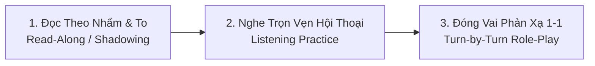

# 🎓 GIA SƯ TIẾNG ANH GIAO TIẾP & KỸ THUẬT AUDIO VISUAL (A1 ➔ A2/PRO)
### 👨‍💻 Tác giả: **By Chí Cường** | Chuyên gia Tư vấn & Kiến trúc Trải nghiệm Audio Visual
*Sổ tay phương pháp đào tạo và ngân hàng kịch bản đối thoại thực chiến hợp nhất (Unified English Coach & Conversation Handbook).*

---

# PHẦN 1: PHƯƠNG PHÁP GIA SƯ & QUY TRÌNH LUYỆN TẬP

## 💡 1. Triết Lý Giảng Dạy Dành Riêng Cho Trình Độ A1
1. **Không tạo áp lực ngữ pháp hàn lâm:** Không bắt nhớ các cấu trúc phức tạp như thì quá khứ hoàn thành hay câu điều kiện loại 3. Tập trung làm chủ 4 thì cốt lõi chiếm 80% giao tiếp: **Hiện tại đơn (Present Simple)**, **Hiện tại tiếp diễn (Present Continuous)**, **Quá khứ đơn (Past Simple)**, và **Tương lai gần (Be going to / Will)**.
2. **Học theo Cụm từ (Chunks) & Khung câu (Sentence Frames):**
   - Thay vì học từ vựng đơn lẻ, học cả cụm định hình sẵn: *I am responsible for...*, *Could you please help me with...*, *Since there is no underfloor conduit, we need to...*
3. **Song ngữ đối chiếu Anh - Việt:** Luôn có nghĩa tiếng Việt kèm theo để người học hiểu sâu bản chất kỹ thuật, không suy đoán mập mờ.

---

## 🎧 2. Quy Trình 3 Bước Luyện Đọc Theo (Read-Along) & Luyện Nghe (Listening)

Mỗi kịch bản đối thoại được thiết kế tối ưu để người học thực hành độc lập hoặc tương tác 1-1:

* **Bước 1 - Đọc theo (Read-Along / Shadowing):** Nhìn từng câu thoại tiếng Anh trong kịch bản và đọc to theo khẩu hình, chú ý các từ khóa in đậm và ngắt nghỉ theo dấu phẩy.
* **Bước 2 - Luyện nghe (Listening):** Mở tệp offline [ENGLISH_AV_TRAINER.html](file:///d:/Workflow/Chi%20Cuong%20Antigravity/CHI%20CUONG%20WORKSPACE/LEARN/ENGLISH_AV_TRAINER.html) hoặc bấm nút `🎬 Video Luyện Nói` để nghe giọng đọc bản xứ phát âm từng câu, kiểm tra khả năng bắt tai từ vựng.
* **Bước 3 - Đối thoại trực tiếp trong Chat:** Gõ tên hoặc số thứ tự chủ đề vào ô chat, Gia sư AI sẽ đóng vai đối phương hỏi từng câu một để bạn tự gõ câu đáp và sửa lỗi ngay lập tức.

---

## 📋 3. Bảng Phản Hồi Sửa Lỗi Cố Định Khi Đối Thoại Trong Chat

| Mục | Nội dung chi tiết |
| :--- | :--- |
| ❌ **Câu bạn nói (Original)** | Câu học viên vừa gõ hoặc nói |
| 🔍 **Nhận xét & Lỗi** | Giải thích bằng tiếng Việt (thiếu động từ to-be, sai thì, thiếu mạo từ, dùng từ chưa tự nhiên...) |
| ✅ **Câu chuẩn cơ bản (Easy to remember)** | Phiên bản ngắn gọn, ngữ pháp chuẩn xác để nhớ ngay tại chỗ |
| 🌟 **Câu tự nhiên chuyên nghiệp (Native/Pro)** | Phiên bản kỹ sư bản xứ thường nói trong họp dự án hoặc giao tiếp công trường |

---

# PHẦN 2: NGÂN HÀNG 11 CHỦ ĐỀ GIAO TIẾP & KỊCH BẢN ĐỌC THEO

---

## 🏢 NHÓM 1: GIAO TIẾP CÔNG SỞ & HẰNG NGÀY (GENERAL & OFFICE)

### 📌 Chủ đề 01: Giới thiệu bản thân & Vai trò Kỹ sư AV
* **Ngữ cảnh thực tế (Scenario):** Buổi họp khởi động dự án (Kick-off meeting) tại văn phòng Ban Quản lý Dự án tòa nhà văn phòng hạng A. Giám đốc dự án (Project Director) mời bạn giới thiệu bản thân và phạm vi công việc của nhà thầu AV trước các bên tư vấn và thầu phụ.
* **Khung câu nòng cốt (Sentence Frame):** `I am responsible for [Hạng mục/Công việc] in [Dự án/Khu vực].`
* **Từ vựng then chốt:** Lead AV Engineer (Kỹ sư trưởng AV), System design (Thiết kế hệ thống), Commissioning (Đo kiểm nghiệm thu), Milestone (Mốc tiến độ), First-fix cabling (Kéo cáp thô đợt 1).

#### 📖 Kịch bản đối thoại hoàn chỉnh (Read-Along Script):
> 👤 **Project Director (Client):**  
> *"Good morning everyone. Could you please introduce yourself and your role on this project?"*  
> *(Chào buổi sáng mọi người. Bạn có thể vui lòng giới thiệu bản thân và vai trò của bạn trong dự án này không?)*  
>  
> 🎯 **You (AV Lead):**  
> *"Good morning! My name is Cuong, and I am the lead AV Engineer. I am responsible for audio-visual system design and site commissioning."*  
> *(Chào buổi sáng! Tôi tên là Cường, là Kỹ sư AV phụ trách chính. Tôi chịu trách nhiệm về thiết kế hệ thống âm thanh - hình ảnh và đo kiểm nghiệm thu tại công trường.)*  
>  
> 👤 **Project Director (Client):**  
> *"Glad to have you with us, Cuong. What is your team's immediate milestone for this month?"*  
> *(Rất vui được hợp tác với bạn, Cường. Mốc tiến độ trước mắt của đội bạn trong tháng này là gì?)*  
>  
> 🎯 **You (AV Lead):**  
> *"Our first milestone is completing first-fix cable pulling and conduit inspection before the ceiling grid is installed."*  
> *(Mốc tiến độ đầu tiên của chúng tôi là hoàn thành kéo cáp thô đợt 1 và kiểm tra ống luồn trước khi lắp khung xương trần thạch cao.)*

---

### 📌 Chủ đề 02: Rủ đồng nghiệp đi ăn trưa & Cà phê (Small Talk)
* **Ngữ cảnh thực tế (Scenario):** 12h trưa tại văn phòng. Bạn vừa hoàn thành bản vẽ bố trí thiết bị phòng họp. Đồng nghiệp Sarah đi ngang qua bàn làm việc và rủ đi ăn trưa, uống cà phê giải lao.
* **Khung câu nòng cốt (Sentence Frame):** `Would you like to grab [Món ăn/Đồ uống] with me at [Thời gian/Địa điểm]?`
* **Từ vựng then chốt:** Buried in drawings (Chúi đầu vào bản vẽ), Ready for a break (Sẵn sàng nghỉ tay), Check out (Ghé thử/Khám phá), Stay sharp (Giữ tỉnh táo/tập trung), Client presentation (Thuyết trình với khách).

#### 📖 Kịch bản đối thoại hoàn chỉnh (Read-Along Script):
> 👤 **Sarah (Colleague):**  
> *"Hey Cuong! It's already noon. Have you had lunch yet, or are you still buried in your drawings?"*  
> *(Chào Cường! Đã 12 giờ trưa rồi. Bạn đã ăn trưa chưa, hay vẫn đang chúi đầu vào bản vẽ thế?)*  
>  
> 🎯 **You (Cuong):**  
> *"Not yet! I just finished the speaker layout. I am definitely ready for a break."*  
> *(Chưa đâu! Tôi vừa làm xong bản vẽ bố trí loa. Tôi hoàn toàn sẵn sàng nghỉ tay rồi.)*  
>  
> 👤 **Sarah (Colleague):**  
> *"Awesome! Let's check out the new noodle shop down the street. Would you like to grab an iced coffee afterwards?"*  
> *(Tuyệt quá! Cùng ghé quán mì mới mở ở cuối phố nhé. Ăn xong bạn có muốn đi uống một ly cà phê đá không?)*  
>  
> 🎯 **You (Cuong):**  
> *"That sounds fantastic! A fresh coffee will help me stay sharp for the client presentation this afternoon."*  
> *(Nghe tuyệt vời đấy! Một ly cà phê sẽ giúp tôi tỉnh táo cho buổi thuyết trình với khách hàng chiều nay.)*

---

### 📌 Chủ đề 03: Báo cáo tiến độ đầu ngày (Daily Standup)
* **Ngữ cảnh thực tế (Scenario):** Cuộc họp điều phối nhanh 10 phút đầu giờ sáng tại văn phòng ban chỉ huy công trường. Quản lý dự án (PM) hỏi về các đầu việc đã xong hôm qua và kế hoạch triển khai trong ngày hôm nay.
* **Khung câu nòng cốt (Sentence Frame):** `Yesterday, I completed [Nhiệm vụ 1], and today I will focus on [Nhiệm vụ 2].`
* **Từ vựng then chốt:** Accomplish (Hoàn thành), Terminate patch panels (Bấm đầu thanh đấu nối mạng), Blockers (Trở ngại/Vướng mắc), Calibrate mic gain (Cân chỉnh độ nhạy micro), Motorized projector lift (Giá nâng hạ máy chiếu tự động).

#### 📖 Kịch bản đối thoại hoàn chỉnh (Read-Along Script):
> 👤 **Project Manager:**  
> *"Good morning Cuong. What did your crew accomplish yesterday, and what is the plan for today?"*  
> *(Chào buổi sáng Cường. Đội của bạn hôm qua đã hoàn thành việc gì, và kế hoạch hôm nay là gì?)*  
>  
> 🎯 **You (AV Lead):**  
> *"Yesterday, we finished terminating all Cat6A patch panels and verified the Dante network ports."*  
> *(Hôm qua, chúng tôi đã hoàn thành bấm đầu toàn bộ thanh đấu nối Cat6A và kiểm tra các cổng mạng chạy Dante.)*  
>  
> 👤 **Project Manager:**  
> *"Very good. Do you have any technical blockers or access issues on site?"*  
> *(Rất tốt. Bạn có gặp trở ngại kỹ thuật hay vướng mắc bàn giao mặt bằng nào không?)*  
>  
> 🎯 **You (AV Lead):**  
> *"No blockers at the moment. Today, I will calibrate the DSP microphone gain and test the motorized projector lifts in the meeting rooms."*  
> *(Hiện tại không có trở ngại gì. Hôm nay, tôi sẽ cân chỉnh độ nhạy mic trên bộ xử lý DSP và chạy thử khung nâng máy chiếu tự động ở các phòng họp.)*

---

### 📌 Chủ đề 04: Xin dời lịch họp & Nhờ đồng nghiệp hỗ trợ gấp
* **Ngữ cảnh thực tế (Scenario):** 2h chiều trên công trường. Kiến trúc sư nội thất hẹn họp lúc 3h chiều để chốt vị trí khoét lỗ trần cho loa, nhưng bạn đang phải trực tiếp kiểm tra sự cố tắc ống luồn dây cáp ngầm với bên cơ điện MEP.
* **Khung câu nòng cốt (Sentence Frame):** `Could we reschedule our meeting to [Thời gian] because [Lý do bận]?`
* **Từ vựng then chốt:** Reschedule (Dời lịch họp), Ceiling coordinates (Tọa độ trần), Conduit blockage (Tắc ống luồn dây), Reflected ceiling plan / RCP (Bản vẽ mặt bằng trần phản xạ), Cutout dimensions (Kích thước khoét lỗ).

#### 📖 Kịch bản đối thoại hoàn chỉnh (Read-Along Script):
> 👤 **Site Architect:**  
> *"Hi Cuong, are we still meeting at 3:00 PM today to review the ceiling speaker coordinates?"*  
> *(Chào Cường, chúng ta vẫn họp lúc 3 giờ chiều nay để rà soát tọa độ loa âm trần chứ?)*  
>  
> 🎯 **You (AV Engineer):**  
> *"I apologize, but could we reschedule our meeting to 4:30 PM? I am resolving an urgent conduit blockage with the MEP team."*  
> *(Tôi rất xin lỗi, liệu chúng ta có thể dời cuộc họp sang 4h30 chiều được không? Tôi đang phải xử lý gấp sự cố tắc ống luồn dây với bên cơ điện.)*  
>  
> 👤 **Site Architect:**  
> *"Sure, no problem at all. 4:30 PM works fine. Do you need me to bring the updated reflected ceiling plan?"*  
> *(Được chứ, không vấn đề gì cả. 4h30 chiều rất thuận tiện. Bạn có cần tôi mang bản vẽ mặt bằng trần phản xạ cập nhật theo không?)*  
>  
> 🎯 **You (AV Engineer):**  
> *"Yes, please! That will help us confirm the exact cutout dimensions and avoid any clashes with ceiling lights."*  
> *(Vâng, nhờ bạn nhé! Như vậy sẽ giúp chúng ta chốt chính xác kích thước khoét lỗ và tránh va chạm với đèn chiếu sáng.)*

---

## 🏗️ NHÓM 2: PHỐI HỢP CÔNG TRƯỜNG & KỸ THUẬT AV (SITE & ENGINEERING)

### 📌 Chủ đề 05: Kiểm tra nguồn điện & Tủ Rack với thầu MEP
* **Ngữ cảnh thực tế (Scenario):** Khảo sát thực địa phòng máy chủ / phòng Rack trung tâm tầng 3 cùng Kỹ sư điện MEP. Bạn cần làm rõ yêu cầu cấp nguồn điện sạch, có tiếp địa độc lập cách ly để chống ù rè âm thanh và đấu nối qua bộ lưu điện UPS.
* **Khung câu nòng cốt (Sentence Frame):** `We require [Yêu cầu kỹ thuật] for the AV rack to prevent [Sự cố phát sinh].`
* **Từ vựng then chốt:** Distribution board (Tủ điện phân phối), Independent 20-amp circuit (Lộ điện 20A độc lập), Isolated earth / ground (Tiếp địa cách ly chống nhiễu), Ground loop (Vòng lặp tiếp địa), 50Hz hum (Tiếng ù xì tần số 50Hz).

#### 📖 Kịch bản đối thoại hoàn chỉnh (Read-Along Script):
> 👤 **Site MEP Engineer:**  
> *"Hello AV team. We are finishing the power distribution board for your rack room. What are your specific electrical requirements?"*  
> *(Chào đội AV. Chúng tôi đang hoàn thiện bảng điện phân phối cho phòng tủ rack của các bạn. Yêu cầu điện cụ thể của các bạn là gì?)*  
>  
> 🎯 **You (Site AV Engineer):**  
> *"We require two independent 20-amp circuits with dedicated isolated earth, connected to the building UPS system."*  
> *(Chúng tôi yêu cầu 2 lộ điện 20 Ampe độc lập có tiếp địa cách ly riêng biệt, được cấp nguồn qua hệ thống lưu điện UPS của tòa nhà.)*  
>  
> 👤 **Site MEP Engineer:**  
> *"Understood. Why is isolated earth strictly needed for this audio equipment?"*  
> *(Đã hiểu. Tại sao thiết bị âm thanh này lại bắt buộc phải có tiếp địa cách ly nghiêm ngặt như vậy?)*  
>  
> 🎯 **You (Site AV Engineer):**  
> *"It eliminates ground loops and prevents 50Hz hum and electromagnetic noise from elevators and air-conditioning motors."*  
> *(Nó loại bỏ vòng lặp tiếp địa và ngăn chặn tiếng ù 50Hz cũng như nhiễu điện từ do động cơ thang máy và máy lạnh gây ra.)*

---

### 📌 Chủ đề 06: Bàn giao hạ tầng cáp âm tường / trần với thầu IT
* **Ngữ cảnh thực tế (Scenario):** Tại phòng họp hội đồng quản trị (Boardroom), đội kéo cáp của thầu IT đang hoàn thiện đấu nối dây mạng LAN. Bạn trao đổi với Giám sát IT để phân định cổng mạng cho micro Dante và màn hình cảm ứng điều khiển.
* **Khung câu nòng cốt (Sentence Frame):** `Did your team terminate the [Loại cáp] cables at [Vị trí cụ thể]?`
* **Từ vựng then chốt:** Terminate lines (Bấm đầu dây), Boardroom floor box (Hộp âm sàn phòng họp lớn), Cat6A drops (Đầu chờ cáp mạng Cat6A), Multicast streams (Luồng truyền đa hướng), Dedicated VLAN (VLAN mạng chuyên dụng).

#### 📖 Kịch bản đối thoại hoàn chỉnh (Read-Along Script):
> 👤 **IT Site Supervisor:**  
> *"Hi Cuong, our cabling crew is terminating network patch panels today. Which zone should we prioritize for AV?"*  
> *(Chào Cường, đội kéo cáp của tôi hôm nay bấm đầu thanh đấu nối patch panel. Bạn muốn ưu tiên khu vực nào cho AV trước?)*  
>  
> 🎯 **You (AV Engineer):**  
> *"Please terminate the boardroom floor box lines first. We need 4 Cat6A drops for Dante ceiling microphones and the touch control panel."*  
> *(Nhờ bên bạn bấm trước các đường hộp âm sàn phòng họp hội đồng. Chúng tôi cần 4 nút mạng Cat6A cho mic âm trần Dante và màn hình điều khiển cảm ứng.)*  
>  
> 👤 **IT Site Supervisor:**  
> *"Got it. Have you prepared the VLAN configuration table for your audio multicast streams?"*  
> *(Đã rõ. Các bạn đã chuẩn bị bảng cấu hình VLAN cho các luồng âm thanh đa hướng multicast chưa?)*  
>  
> 🎯 **You (AV Engineer):**  
> *"Yes, I have. We need VLAN 20 dedicated to Dante traffic with Quality of Service enabled and Green Ethernet turned off."*  
> *(Vâng, tôi đã chuẩn bị rồi. Chúng tôi cần VLAN 20 dành riêng cho dữ liệu Dante, có bật chế độ ưu tiên QoS và tắt tính năng tiết kiệm điện Green Ethernet.)*

---

### 📌 Chủ đề 07: Xử lý sự cố âm thanh ù rè & Mất đồng bộ Dante Clock
* **Ngữ cảnh thực tế (Scenario):** Buổi tổng duyệt âm thanh 2 tiếng trước sự kiện khánh thành hội trường. Loa siêu trầm bị tiếng ù nền rất lớn, đồng thời phần mềm Dante Controller báo lỗi mất đồng bộ xung nhịp (Clock sync error).
* **Khung câu nòng cốt (Sentence Frame):** `There is [Hiện tượng lỗi] on [Thiết bị/Kênh], so let's verify [Nguyên nhân nghi vấn].`
* **Từ vựng then chốt:** Emergency (Sự cố khẩn cấp), Severe hum (Tiếng ù rè nghiêm trọng), Clock sync error (Lỗi mất đồng bộ xung nhịp), Energy Efficient Ethernet / Green Ethernet (Chế độ tiết kiệm điện trên switch), Audio ground isolator (Bộ cách ly tiếp địa âm thanh).

#### 📖 Kịch bản đối thoại hoàn chỉnh (Read-Along Script):
> 👤 **Audio Technician:**  
> *"Cuong, we have an emergency! The ceiling subwoofers have a loud humming sound, and Dante Controller shows clock sync errors."*  
> *(Cường ơi, chúng ta gặp ca khẩn cấp rồi! Loa siêu trầm âm trần bị tiếng ù rất to, và Dante Controller đang báo lỗi mất đồng bộ xung nhịp.)*  
>  
> 🎯 **You (Senior AV):**  
> *"Stay calm. First, log into the network switch and check if Energy Efficient Ethernet is disabled on all Dante ports."*  
> *(Bình tĩnh nào. Đầu tiên, hãy đăng nhập vào switch mạng và kiểm tra xem tính năng tiết kiệm điện EEE đã được tắt trên tất cả các cổng Dante chưa.)*  
>  
> 👤 **Audio Technician:**  
> *"Checking now... Ah, port 12 still had Green Ethernet active! I just disabled it, and the clock status turned green immediately."*  
> *(Tôi kiểm tra ngay... À, cổng 12 vẫn còn bật Green Ethernet! Tôi vừa tắt đi và trạng thái clock đã chuyển sang màu xanh ngay lập tức.)*  
>  
> 🎯 **You (Senior AV):**  
> *"Excellent! Now for the analog subwoofer hum, let's insert an audio ground isolator between the DSP output and the power amplifier."*  
> *(Xuất sắc! Còn về tiếng ù analog của loa sub, hãy đấu thêm bộ cách ly tiếp địa giữa đầu ra DSP và âm ly công suất.)*

---

### 📌 Chủ đề 08: Hướng dẫn khách hàng dùng màn hình cảm ứng (Touch Panel SOP)
* **Ngữ cảnh thực tế (Scenario):** Bàn giao phòng họp cho Ban Thư ký trước cuộc họp Hội đồng Quản trị. Bạn hướng dẫn người dùng cuối thao tác kích hoạt hệ thống một chạm, cắm cáp chia sẻ hình ảnh và chỉnh âm lượng.
* **Khung câu nòng cốt (Sentence Frame):** `Just tap [Nút điều khiển] on the touch panel to [Chức năng thực hiện].`
* **Từ vựng then chốt:** Touch screen / Touch panel (Màn hình cảm ứng điều khiển), Wake up (Đánh thức/Bật sáng màn hình), Presentation button (Nút chọn nguồn trình chiếu), Powers on display (Tự động bật màn hình), Presentation mode (Chế độ chiếu phim/thuyết trình).

#### 📖 Kịch bản đối thoại hoàn chỉnh (Read-Along Script):
> 👤 **Client Secretary:**  
> *"Hi Cuong! The board meeting starts in 15 minutes. Can you show me how to present my laptop screen from this touch screen?"*  
> *(Chào Cường! 15 phút nữa cuộc họp hội đồng bắt đầu rồi. Bạn chỉ giúp tôi cách trình chiếu màn hình laptop từ màn hình cảm ứng này được không?)*  
>  
> 🎯 **You (AV Engineer):**  
> *"Of course, it is very simple. Just tap the screen to wake it up, then press the 'Presentation' button on the main dashboard."*  
> *(Dạ tất nhiên rồi, rất đơn giản ạ. Chị chỉ cần chạm vào màn hình để bật sáng, sau đó nhấn nút 'Presentation' trên bảng điều khiển chính.)*  
>  
> 👤 **Client Secretary:**  
> *"Do I need to find the TV remote to turn on the large display on the wall?"*  
> *(Tôi có cần phải tìm điều khiển TV để bật màn hình lớn trên tường không?)*  
>  
> 🎯 **You (AV Engineer):**  
> *"No need at all! The system automatically powers on the display, selects your HDMI input, and adjusts the room lights to presentation mode."*  
> *(Dạ hoàn toàn không cần ạ! Hệ thống sẽ tự động bật màn hình, chọn đúng cổng HDMI của chị và tự động chuyển đèn phòng sang chế độ hội thảo.)*

---

### 📌 Chủ đề 09: Báo phát sinh chi phí & Thi công nẹp sàn bán nguyệt (Additional Cost & Floor Trunking)
* **Ngữ cảnh thực tế (Scenario):** Khách hàng/Quản lý Dự án (Client PM) quyết định dời bàn họp hội nghị cách xa tường 3 mét ra giữa phòng khi sàn nhà đã hoàn thiện lát gỗ và không có ống âm sàn. Bạn tư vấn giải pháp nẹp sàn bán nguyệt chịu lực và thông báo việc phát sinh chi phí ngoài hợp đồng (Variation Order).
* **Khung câu nòng cốt (Sentence Frame):** `Since there is no underfloor conduit, we need to [Giải pháp kỹ thuật], which will incur [Chi phí/Thủ tục].`
* **Từ vựng then chốt:** Underfloor conduit (Ống luồn âm sàn), Heavy-duty half-round floor trunking (Nẹp sàn bán nguyệt chịu lực), Trip hazard (Nguy cơ vấp ngã), Out of original scope (Ngoài phạm vi hợp đồng ban đầu), Variation Order / VO (Phiếu yêu cầu phát sinh thay đổi), Written approval (Phê duyệt bằng văn bản).

#### 📖 Kịch bản đối thoại hoàn chỉnh (Read-Along Script):
> 👤 **Project Manager (Client):**  
> *"Hi Cuong, we decided to move the conference table 3 meters away from the wall. Can you run the HDMI and microphone cables across the floor?"*  
> *(Chào Cường, bên anh quyết định dời bàn họp cách tường 3 mét. Em kéo dây HDMI và micro trên mặt sàn giúp anh được không?)*  
>  
> 🎯 **You (AV Lead):**  
> *"Since there is no underfloor conduit here, we must install heavy-duty half-round floor trunking to protect the cables and prevent trip hazards."*  
> *(Vì ở đây không có ống âm sàn, chúng ta bắt buộc phải lắp nẹp sàn bán nguyệt chịu lực để bảo vệ dây cáp và chống nguy cơ vấp ngã cho mọi người.)*  
>  
> 👤 **Project Manager (Client):**  
> *"Understood. Will this installation incur any additional cost for our project?"*  
> *(Đã rõ. Vậy việc lắp đặt này có phát sinh thêm chi phí nào cho dự án của chúng ta không?)*  
>  
> 🎯 **You (AV Lead):**  
> *"Yes, this modification is out of our original contract scope. I will submit a variation order with the trunking material quote for your written approval today."*  
> *(Dạ có, phần điều chỉnh này nằm ngoài phạm vi hợp đồng ban đầu. Em sẽ gửi phiếu phát sinh kèm báo giá vật tư nẹp sàn để anh phê duyệt bằng văn bản ngay hôm nay.)*

---

## 🌐 NHÓM 3: LÀM VIỆC VỚI HÃNG & ĐỐI TÁC NƯỚC NGOÀI (SUPPLIER & VENDOR)

### 📌 Chủ đề 10: Hỏi báo giá, tồn kho & Thời gian giao hàng (Lead Time)
* **Ngữ cảnh thực tế (Scenario):** Trao đổi trực tuyến với Giám đốc kinh doanh vùng (Regional Sales Director) của hãng thiết bị DSP âm thanh tại Singapore để chốt đơn giá dự án và tiến độ giao hàng cho hồ sơ thầu khu nghỉ dưỡng cao cấp.
* **Khung câu nòng cốt (Sentence Frame):** `Could you confirm the [Thông số thương mại] for [Số lượng] units of [Model sản phẩm]?`
* **Từ vựng then chốt:** Finalizing equipment list (Chốt danh mục thiết bị), Stock availability (Tình trạng tồn kho), Project registration pricing (Giá hỗ trợ đăng ký dự án), Factory lead time (Thời gian sản xuất xuất xưởng), CIF Haiphong terms (Điều kiện giao hàng CIF cảng Hải Phòng).

#### 📖 Kịch bản đối thoại hoàn chỉnh (Read-Along Script):
> 👤 **Regional Sales Director:**  
> *"Good afternoon Cuong. Thank you for reaching out. Are you finalizing the equipment list for the 5-star resort project?"*  
> *(Chào buổi chiều Cường. Cảm ơn bạn đã liên hệ. Có phải bạn đang chốt danh mục thiết bị cho dự án khu nghỉ dưỡng 5 sao không?)*  
>  
> 🎯 **You (Pre-sales Consultant):**  
> *"Yes, exactly. Could you confirm current stock availability and project registration pricing for 12 units of the Core DSP processor?"*  
> *(Vâng, chính xác ạ. Nhờ bạn xác nhận tình trạng tồn kho hiện tại và mức giá hỗ trợ đăng ký dự án cho 12 bộ vi xử lý Core DSP nhé.)*  
>  
> 👤 **Regional Sales Director:**  
> *"We currently have 4 units in stock in Singapore, and 8 units will require a 4-week factory lead time. We can offer a special 12% project discount."*  
> *(Hiện tại chúng tôi có sẵn 4 chiếc tại kho Singapore, còn 8 chiếc sẽ cần thời gian đặt hàng 4 tuần từ nhà máy. Chúng tôi có thể chiết khấu đặc biệt 12% cho dự án.)*  
>  
> 🎯 **You (Pre-sales Consultant):**  
> *"Four weeks works well with our cabling schedule. Please send over the formal quotation with CIF Haiphong shipping terms by tomorrow morning."*  
> *(4 tuần hoàn toàn phù hợp với tiến độ thi công cáp của chúng tôi. Nhờ bạn gửi báo giá chính thức theo điều kiện giao hàng CIF Hải Phòng trước sáng mai nhé.)*

---

### 📌 Chủ đề 11: Yêu cầu hỗ trợ kỹ thuật khi thiết bị lỗi Firmware (Tech Support Ticket)
* **Ngữ cảnh thực tế (Scenario):** Bộ vi xử lý trung tâm DSP tại công trường bị ngắt điện đột ngột trong lúc đang nâng cấp firmware. Sau khi khởi động lại, thiết bị bị treo, mất kết nối mạng và đèn nguồn nhấp nháy đỏ. Bạn gọi điện cho Kỹ sư hỗ trợ kỹ thuật quốc tế Tier-2 của hãng để xử lý.
* **Khung câu nòng cốt (Sentence Frame):** `The device is [Trạng thái lỗi], and the status LED is [Hiện tượng đèn].`
* **Từ vựng then chốt:** High-priority ticket (Yêu cầu hỗ trợ ưu tiên khẩn), Unresponsive on local network (Không phản hồi trên mạng LAN), Flashing red rapidly (Nhấp nháy đỏ liên tục), Bootloader corrupted (Hỏng trình khởi động cơ sở), Serial recovery tool (Công cụ cứu hộ nạp qua cổng nối tiếp).

#### 📖 Kịch bản đối thoại hoàn chỉnh (Read-Along Script):
> 👤 **Tier-2 Tech Support Engineer:**  
> *"Hello Tech Support here. I received your high-priority ticket regarding the Dante processor. What is the current status of the device?"*  
> *(Xin chào, bộ phận hỗ trợ kỹ thuật đây. Tôi nhận được yêu cầu ưu tiên cao của bạn về bộ xử lý Dante. Trạng thái hiện tại của thiết bị thế nào?)*  
>  
> 🎯 **You (AV Field Engineer):**  
> *"The processor is completely unresponsive on the local network, and the front power LED is flashing red rapidly after a failed firmware update."*  
> *(Bộ xử lý hoàn toàn không phản hồi trên mạng nội bộ, và đèn LED nguồn phía trước đang nhấp nháy đỏ liên tục sau khi bị lỗi nâng cấp firmware.)*  
>  
> 👤 **Tier-2 Tech Support Engineer:**  
> *"Understood. The internal bootloader seems corrupted. Can you connect a USB console cable and launch our serial recovery tool?"*  
> *(Đã hiểu. Bộ nạp khởi động bootloader bên trong có vẻ đã bị hỏng. Bạn có thể cắm cáp console USB và mở công cụ khôi phục qua cổng nối tiếp của chúng tôi không?)*  
>  
> 🎯 **You (AV Field Engineer):**  
> *"Yes, I have the serial cable connected to my laptop right now. Please provide the firmware recovery file and the terminal command instructions."*  
> *(Vâng, tôi đã cắm cáp nối tiếp vào máy tính xách tay rồi. Nhờ bạn gửi file khôi phục firmware và các câu lệnh hướng dẫn qua terminal nhé.)*

---

# PHẦN 3: KẾT NỐI VỚI ỨNG DỤNG OFFLINE & VIDEO REEL

Khi bạn muốn nghe phát âm giọng bản xứ hoặc tự động xuất video clip ngắn kèm phụ đề và đồng hồ luyện nói:
1. Mở tệp [ENGLISH_AV_TRAINER.html](file:///d:/Workflow/Chi%20Cuong%20Antigravity/CHI%20CUONG%20WORKSPACE/LEARN/ENGLISH_AV_TRAINER.html) trực tiếp bằng trình duyệt Chrome hoặc Edge trên máy tính (hoạt động 100% Offline, không cần mạng).
2. Tại menu thả trên cùng, chọn đúng mã chủ đề bạn đang muốn học (ví dụ: **Chủ đề 09: Báo phát sinh chi phí & nẹp bán nguyệt**).
3. **Luyện nghe & đọc theo từng câu:** Chuyển sang **Tab 3: Hội Thoại Phối Hợp** để bấm biểu tượng 🔊 nghe phát âm chuẩn của từng lời thoại.
4. **Luyện nói cùng Video ngắn:** Bấm nút màu hồng **`🎬 Video Luyện Nói`** để mở trình phát Video Cinema 16:9 kèm ảnh bối cảnh thực tế [floor_trunking_av.jpg](file:///d:/Workflow/Chi%20Cuong%20Antigravity/CHI%20CUONG%20WORKSPACE/LEARN/assets/floor_trunking_av.jpg), phụ đề chữ to và vòng đếm ngược 4 giây để bạn đọc to theo nhân vật!
